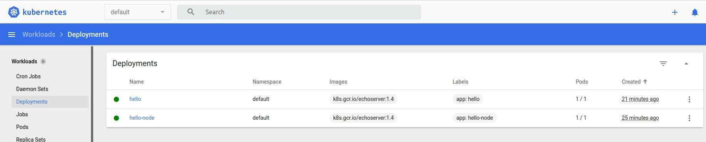

# Metodyki DevOps 2021/2022 NS
Zajęcia 05 - 2021-01-15
---
# Zestawienie platformy Kubernetes
* Zainstaluj minikube i kubectl


Instalacja przebiegła bez problemu, aż do momentu sprawdzenia minikube dashboard - gdzie otrzymujemy:


Praca z WSL2 wymaga dodatkowego przygotowanie środowiska, natmoiast w tym momencie musiałem zmienić środowisko na VirtualBox

Instalacja przebiegła bez problemu, minikube dashboard również działa:


Instalacja kubectl:

```curl -LO "https://dl.k8s.io/release/$(curl -L -s https://dl.k8s.io/release/stable.txt)/bin/linux/amd64/kubectl"```

```sudo install -o root -g root -m 0755 kubectl /usr/local/bin/kubectl```

```kubectl version --client```

```kubectl get po -A```


* Przedstaw uruchomione oprogramowanie wstępne (i usługi)
  * Platforma konteneryzacji
  

  
  * Otwarte porty


  
  * Stan Dockera
  


# Stan Minikube
* Uruchom Minikube Dashboard


* Wyświetl działające usługi (k8s) i wdrożenia


* Wyświetl dostępne wdrożenia (stan "przed")


# Wdrożenie kontenera via k8s
* Wdróż przykładowy deployment "hello k8s": ```k8s.gcr.io/echoserver```

 ```kubectl create deployment hello --image=k8s.gcr.io/echoserver:1.4```

* Użyj ```kubectl run <ctr> --image=<DOCKER_ID>/ --port=<port> --labels app=ctr```

```kubectl run hello --image=k8s.gcr.io/echoserver:1.4 --port=80 labels app=ctr``

* Przekieruj porty

```kubectl expose deployment hello --type=NodePort --port=8080```

* Wykaż że wdrożenie nastąpiło
 
 ```minikube service hello```
 

   



       

      

# Deployment
* Utwórz plik YAML z "deploymentem" k8s


* Zestaw 4 repliki, opisz zalety i wady takiej liczby
zalety: można łatwo zmienić liczbę replik, przy awarii 1 repliki - wciąż działają pozostałe
wady: większe zużycie zasobów przy utrzymaniu 4 replik, większe koszty utrzymywania
   
* Zaaplikuj wdrożenie via ```kubectl apply -f plik.yml```


   
* Wykaż przeprowadzony deployment


   

