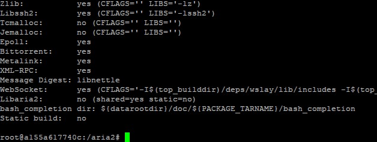

# Metodyki DevOps - sprawozdanie - zajęcia 02

## Instalacja **docker**

W celu instalacji **docker** na Ubuntu, należy wykonać w terminalu następującą komendę:

`sudo apt install docker-ce`

Jak wynika z powyższego zrzutu ekranu, na moim systemie aplikacja już była zainstalowana.

Możemy zwrócić numer wersji za pomocą komendy:

`docker --version`

## Tworzenie konta na Docker Hub

Przechodzimy na stronę https://hub.docker.com i rejestrujemy nowe konto za pomocą panelu widocznego na głównej stronie.

## Pobieranie obrazów dostępnych na Docker Hub

Po znalezieniu obrazu, który nas interesuje na Docker Hub, możemy pobrać obraz do naszej maszyny przy pomocy komendy:

`docker pull <nazwa obrazu>`

Na przykład poniższa komenda pobierze obraz **hello-world**:

`docker pull hello-world`

## Uruchamianie pobranych obrazów

Uruchomienie pobranych obrazów odbywa się za pomocą komendy:

`docker run <nazwa obrazu>`

W naszym przykładzie:

`docker run hello-world`

`docker run mysql`

`docker run ubuntu`

Jeżeli uruchomimy komendę `run` bez wcześniejszego pobrania obrazu, zostanie on automatycznie pobrany.

Po uruchomieniu obrazu **busybox** nic się nie wykonuje, ponieważ nie przekazaliśmy żadnych parametrów do shella. Możemy uruchomić obraz interaktywnie za pomocą komendy:

`docker run -it busybox`

Wersję **busybox** możemy wyświetlić za pomocą komendy wykonanej w kontenerze:

`busybox | head -1`

## Uruchamianie "systemu w kontenerze"

Aby uruchomić Ubuntu w kontenerze i uzyskać dostęp do konsoli, używamy komendy:

`docker run -it ubuntu`

Aby zobaczyć aktualnie uruchomione procesy w kontenerze, wykonujemy polecenie `ps` - procesem PID 1 jest **bash**.

Listę procesów na hoście możemy wywołać przy pomocy komendy:

`docker top <id kontenera>`

W uruchomionym kontenerze z Ubuntu wykonujemy polecenie `apt update && apt upgrade`, aby zaktualizować pakiety i następnie wychodzimy z kontenera poleceniem `exit`.

## Lista kontenerów

Możemy sprawdzić jakie aktualnie mamy uruchomione kontenery za pomocą komendy:

`docker ps`

Gdy wykonamy poniższą komendę, zwrócone zostaną wszystkie kontenery:

`docker ps -a`

Możemy usunąc kontener przy pomocy komendy:

`docker rm <id kontenera>`

## Lista obrazów i usuwanie obrazów

Wyświetlić listę wszystkich obrazów aktualnie pobranych na naszym hoście możemy przy pomocy komendy:

`docker images`

Usunąć pobrany obraz możemy przy pomocy komendy:

`docker image rm <id obrazu/nazwa>`

Może być wymagane najpierw usunięcie kontenerów, które korzystają z obrazów, które chcemy usunąć - zostaniemy o tym poinformowani przy próbie usunięcia takiego obrazu.

## Budowanie programu w kontenerze

Aby zbudować program w kontenerze, najpierw uruchamiamy kontener z czystym obrazem Ubuntu:

`docker run -it ubuntu`

Jako program, który będę buildował w Dockerze, wybrałem [aria2](https://github.com/aria2/aria2).

W uruchomionym kontenerze instalujemy wszystkie zależności wymagane do zbudowania aplikacji:

`apt update && apt install build-essential git libgnutls28-dev nettle-dev libgmp-dev libssh2-1-dev libc-ares-dev libxml2-dev zlib1g-dev libsqlite3-dev pkg-config libxml2-dev libcppunit-dev autoconf automake autotools-dev autopoint libtool -y`

Po zainstalowaniu zależności, klonujemy repozytorium:

`git clone https://github.com/aria2/aria2.git`

I przechodzimy do katalogu z repozytorium:

`cd aria2`

Według README w repozytorium, aby zbudować aplikację należy wykonać następujące komendy:

`autoreconf -i`

`./configure`

`make`

Po zbudowaniu aplikacji, możemy uruchomić testy:

`make check`

## Tworzenie Dockerfile

Gdy posiadamy już komendy, które były nam potrzebne do zbudowania aplikacji na czystym obrazie Ubuntu, możemy przystąpić do zbudowania pliku, który proces ten nam zautomatyzuje - Dockerfile.

    FROM ubuntu

    ARG DEBIAN_FRONTEND=noninteractive
    ENV TZ=Europe/Warsaw

    RUN apt update && apt install build-essential git libgnutls28-dev nettle-dev libgmp-dev libssh2-1-dev libc-ares-dev libxml2-dev zlib1g-dev libsqlite3-dev pkg-config libxml2-dev libcppunit-dev autoconf automake autotools-dev autopoint libtool -y
    RUN git clone https://github.com/aria2/aria2.git
    WORKDIR aria2

    RUN autoreconf -i
    RUN ./configure
    RUN make

`FROM` mówi na podstawie jakiego obrazu będziemy tworzyć nasz obraz.

`ARG DEBIAN_FRONTEND=noninteractive` poinformuje system, że potrzebujemy zero interakcji przy korzystaniu z **apt** - program nie będzie nas pytał o np. potwierdzenie jakiejś operacji, tylko wybierze domyślną.

`ENV TZ=Europe/Warsaw` jest potrzebne, ponieważ jednym z pakietów, który jest instalowany za pomocą komendy **apt**, jest **tzdata** - podczas instalacji zapyta nas o informację na temat strefy czasowej, w której się znajdujemy. Jeżeli ustawimy tę strefę czasową jako zmienną środowiskową - to automatycznie zostanie ona wykorzystana podczas instalacji.

`RUN` spowoduje wykonanie komendy, którą podamy po nim.

`WORKDIR` działa jak komenda **cd** - zmieni nasz aktualny folder.

Uruchomić tak zbudowany Dockerfile możemy następującą komendą:

`docker build -t aria2:latest . -f ./aria2-dockerfile`

Jeżeli chcemy, aby dodatkowo nasz plik Dockerfile uruchamiał testy, musimy dodać kolejną linijkę na samym końcu:

    FROM ubuntu

    ARG DEBIAN_FRONTEND=noninteractive
    ENV TZ=Europe/Warsaw

    RUN apt update && apt install build-essential git libgnutls28-dev nettle-dev libgmp-dev libssh2-1-dev libc-ares-dev libxml2-dev zlib1g-dev libsqlite3-dev pkg-config libxml2-dev libcppunit-dev autoconf automake autotools-dev autopoint libtool -y
    RUN git clone https://github.com/aria2/aria2.git
    WORKDIR aria2

    RUN autoreconf -i
    RUN ./configure
    RUN make
    RUN make check

Możemy też zamknąć to w jednym Dockerfile w ten sposób:

    FROM ubuntu AS base

    ARG DEBIAN_FRONTEND=noninteractive
    ENV TZ=Europe/Warsaw

    RUN apt update && apt install build-essential git libgnutls28-dev nettle-dev libgmp-dev libssh2-1-dev libc-ares-dev libxml2-dev zlib1g-dev libsqlite3-dev pkg-config libxml2-dev libcppunit-dev autoconf automake autotools-dev autopoint libtool -y
    RUN git clone https://github.com/aria2/aria2.git
    WORKDIR aria2

    RUN autoreconf -i
    RUN ./configure
    RUN make

    FROM base AS test
    RUN make check

Do pierwszej linijki sprecyzowaliśmy nazwę etapu budowy - jako base - podstawową, która jest tutaj wymagana.

Na samym końcu dodaliśmy nowy etap budowy - test. Tylko jeżeli sprecyzujemy nasz target jako test, komendy zapisane pod tym etapem zostaną wykonane.

Wtedy jeżeli chcemy zbudować obraz z testami, wykonujemy następującą komendę:

`sudo docker build -t aria2:latest . -f ./aria2-dockerfile --target=test`

A jeżeli chcemy utworzyć sam obraz podstawowy:

`sudo docker build -t aria2:latest . -f ./aria2-dockerfile --target=base`

## docker-compose.yml

Również możemy stworzyć plik **docker-compose.yml** i za jego pomocą tworzyć kontenery.

Poniżej przykład pliku, gdzie na podstawie bazowego obrazu **aria2** budowany jest dodatkowo obraz **aria2-test**, gdzie dodatkowo wykonywana jest komenda **make check** odpowiadająca za uruchomienie testów.

    version: "3.4"

    services:
        aria2:
            &aria2
            build:
                context: ./
                dockerfile: aria2-dockerfile
                target: base

        aria2-test:
            <<: *aria2
            command:
                make check

Uruchomić proces tworzenia kontenerów przez tak stworzony plik możemy komendą:

`docker-compose up`

