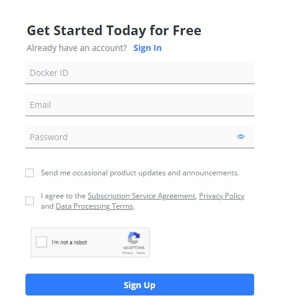

# Metodyki DevOps - sprawozdanie - zajęcia 02

## Instalacja **docker**

W celu instalacji **docker** na Ubuntu, należy wykonać w terminalu następującą komendę:

`sudo apt install docker-ce`

Jak wynika z powyższego zrzutu ekranu, na moim systemie aplikacja już była zainstalowana.

Możemy zwrócić numer wersji za pomocą komendy:

`docker --version`

## Tworzenie konta na Docker Hub

Przechodzimy na stronę https://hub.docker.com i rejestrujemy nowe konto za pomocą panelu widocznego na głównej stronie.

## Pobieranie obrazów dostępnych na Docker Hub

Po znalezieniu obrazu, który nas interesuje na Docker Hub, możemy pobrać obraz do naszej maszyny przy pomocy komendy:

`docker pull <nazwa obrazu>`

Na przykład poniższa komenda pobierze obraz **hello-world**:

`docker pull hello-world`

## Uruchamianie pobranych obrazów

Uruchomienie pobranych obrazów odbywa się za pomocą komendy:

`docker run <nazwa obrazu>`

W naszym przykładzie:

`docker run hello-world`

`docker run mysql`

`docker run ubuntu`

Jeżeli uruchomimy komendę `run` bez wcześniejszego pobrania obrazu, zostanie on automatycznie pobrany.

Po uruchomieniu obrazu **busybox** nic się nie wykonuje, ponieważ nie przekazaliśmy żadnych parametrów do shella. Możemy uruchomić obraz interaktywnie za pomocą komendy:

`docker run -it busybox`

Wersję **busybox** możemy wyświetlić za pomocą komendy wykonanej w kontenerze:

`busybox | head -1`

## Uruchamianie "systemu w kontenerze"

Aby uruchomić Ubuntu w kontenerze i uzyskać dostęp do konsoli, używamy komendy:

`docker run -it ubuntu`

Aby zobaczyć aktualnie uruchomione procesy w kontenerze, wykonujemy polecenie `ps` - procesem PID 1 jest **bash**.

Listę procesów na hoście możemy wywołać przy pomocy komendy:

`docker top <id kontenera>`

W uruchomionym kontenerze z Ubuntu wykonujemy polecenie `apt update && apt upgrade`, aby zaktualizować pakiety i następnie wychodzimy z kontenera poleceniem `exit`.

## Lista kontenerów

Możemy sprawdzić jakie aktualnie mamy uruchomione kontenery za pomocą komendy:

`docker ps`

Gdy wykonamy poniższą komendę, zwrócone zostaną wszystkie kontenery:

`docker ps -a`

Możemy usunąc kontener przy pomocy komendy:

`docker rm <id kontenera>`

## Lista obrazów i usuwanie obrazów

Wyświetlić listę wszystkich obrazów aktualnie pobranych na naszym hoście możemy przy pomocy komendy:

`docker images`

Usunąć pobrany obraz możemy przy pomocy komendy:

`docker image rm <id obrazu/nazwa>`

Może być wymagane najpierw usunięcie kontenerów, które korzystają z obrazów, które chcemy usunąć - zostaniemy o tym poinformowani przy próbie usunięcia takiego obrazu.