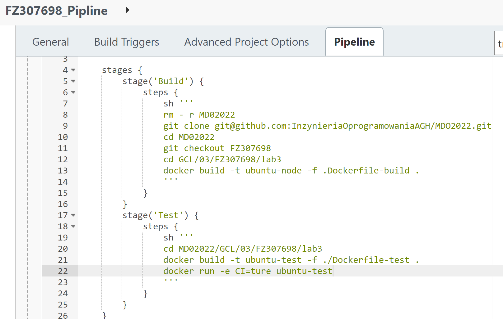
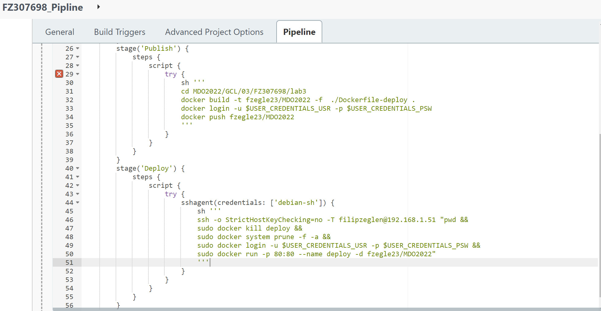
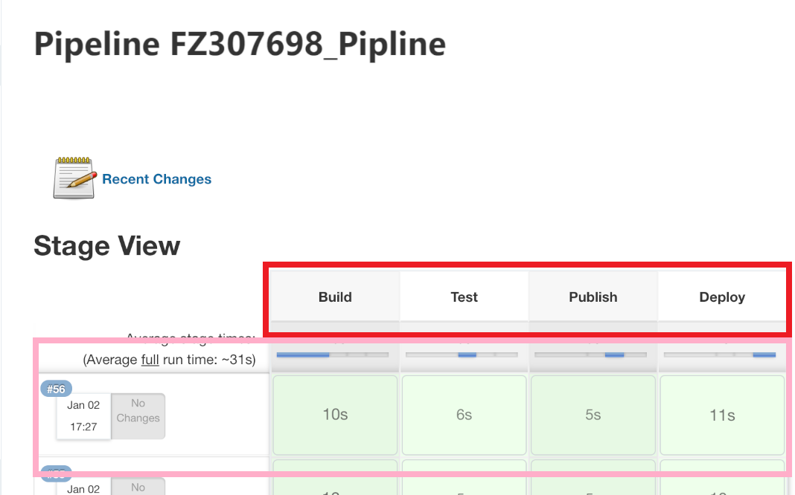
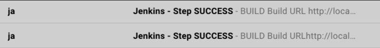

# Zajęcia 4
## Jenkinsfile: przebieg (Build + Test + Publish + Deploy)
Dokumentacja: https://www.jenkins.io/doc/book/pipeline/jenkinsfile/

Kroki w Jenkinsie:
**Build** - *Krok 1:* zbudujemy obraz z Dockerfile.
**Test** - *Krok 2:* zbudujemy obraz z Dockerfile oraz go przetestujemy.
**Publish** - *Krok 3:* zbudujemy obraz z Dockerfile oraz wypchniemy go do dockerhuba.
**Deploy** - *Krok4:* pobramy obraz z kroku 'publish', następnie uruchomiamy obraz.

```
pipeline {
    agent any
    
    stages {
        stage('Build') {
            steps {
                sh '''
                rm - r MDO2022
                git clone git@github.com:InzynieriaOprogramowaniaAGH/MDO2022.git
                cd MDO2022
                git checkout FZ307698
                cd GCL/03/FZ307698/lab3
                docker build -t ubuntu-node -f .Dockerfile-build .
                '''
            }
        }
        stage('Test') {
            steps {
                sh '''
                cd MDO2022/GCL/03/FZ307698/lab3
                docker build -t ubuntu-test -f ./Dockerfile-test .
                docker run -e CI=ture ubuntu-test
                '''
            }
        }
        stage('Publish') {
            steps {
                script {
                    try {
                        sh '''
                        cd MDO2022/GCL/03/FZ307698/lab3
                        docker build -t fzegle23/MDO2022 -f  ./Dockerfile-deploy .
                        docker login -u $USER_CREDENTIALS_USR -p $USER_CREDENTIALS_PSW
                        docker push fzegle23/MDO2022
                        '''
                    }
                }
            }
        }
        stage('Deploy') {
            steps {
                script {
                    try {
                        sshagent(credentials: ['debian-sh']) {
                            sh '''
                            ssh -o StrictHostKeyChecking=no -T filipzeglen@192.168.1.51 "pwd &&
                            sudo docker kill deploy &&
                            sudo docker system prune -f -a &&
                            sudo docker login -u $USER_CREDENTIALS_USR -p $USER_CREDENTIALS_PSW &&
                            sudo docker run -p 80:80 --name deploy -d fzegle23/MDO2022"
                            '''
                        }
                    }
                }
            }
        }
    }
}
```




Poniżej zrzut poprawnie zbudowanego pipeline



### Jenkinsfile: powiadomienia
Sekcja "post" dla każdego stage'a, informująca mailem o rezultacie
Do wysyłania powiadomień użyjemy Serwisu SMTP SendGrid https://sendgrid.com/solutions/email-api/smtp-service/

  
### Jenkinsfile: deploy

Wypychamy obraz do dockerhuba, następnie w kroku robimy deploy, pobieramy nowy obraz z dockerhuba, uruchamiamy obraz.