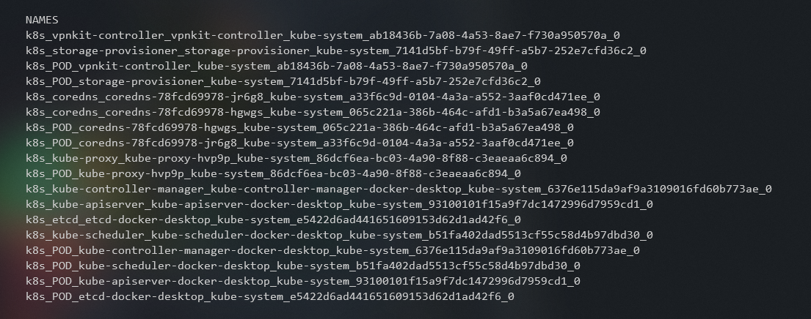

# Zajęcia 05

### Zestawienie platformy Kubernetes
Na potrzeby wykonania laboratorium w środowisku WSL2, będziemy potrzebowali zainstalować desktopową wersję Dockera dla Windowsa.

1. Instalacja Kubernetes pod Docker Desktop
    - Należy zainstalować Kubernetesa w Desktopowej Aplikacji Docker. `Wybierz ustawienia -> Kubernetes -> zaznacz 'Enable Kubernetes' i 'Show system containers' -> Apply & Restart`
    
    
2. Zainstaluj wymagania wstępne dla środowiska Minikube
    - W przypadku WSL2 instalacja Minikube'a nie będzie potrzebna. Na potrzeby laboratorium wystarczy polecenie `kubectl`
    
3. Zainstaluj minikube i kubectl 
    - Wykonaj polecenie `kubectl version` 
    - 
    

4. Przedstaw uruchomione oprogramowanie wstępne (i usługi)
    - Platforma konteneryzacji
    
    
    
    - Otwarte porty
    
    
    
    
    - Stan Dockera
    
    
    
    
    
### Stan Minikube
1. Uruchom Minikube Dashboard
    - Wyświetl obiekty k8s używając `kubectl get pods` [Zamiast Dashboarda Minikube]
2. Wyświetl działające usługi (k8s) i wdrożenia
    - Wykorzystaj do tego polecenie `kubectl get services`
    
    
    
### Wdrożenie kontenera via k8s
1. Wdróż przykładowy deployment "hello k8s": k8s.gcr.io/echoserver. 
    - Użyj polecenia: `kubectl create deployment hello-node --image=k8s.gcr.io/echoserver:1.4`
    - Następnie użyj polecenia: `kubectl run hello-node --image=k8s.gcr.io/echoserver:1.4 --port=80 --labels app=hello-node` 
    
    
    
3. Przekieruj porty 
    - Porty został przekierowane podczas w/w polecenia `run` z dodaną flagą `--port`
    
4. Wykaż że wdrożenie nastąpiło
    - Użyj polecenia `get pods` lub `describe` aby wyświetlić szczegółowy opis danego obiektu : `kubectl describe pod hello-node` 
    
    
    
    
5. W przypadku "niemożliwych" wdrożeń, opisz napotkane ograniczenia
    - Najbardziej oczywistymi ograniczeniami we wszystkich wdrożeniach mogą okazać się dostępne zasoby w środowisku produkcyjnym z czym wiąże się dość popularny problem,
    w którym młody devops używając rozwiązań chmurowych, nie zbadał zużytych zasobów i musiał zapłacić gigatnyczną kwotę dostawcy usługi. https://niebezpiecznik.pl/post/ile-kosztuje-niewiedza-w-chmurze-analiza-5-niepotrzebnie-wysokich-rachunkow/
### Deployment
1. Utwórz plik YAML z "deploymentem" k8s
    - Stwórz plik deployment.yaml. Polecam wykorzystać do tego edytor VS Code. Komenda w konsoli `code .` i edytować plik yaml w nim
2. Zestaw 4 repliki, opisz zalety i wady takiej liczby

    
    
    Zalety:
     - Zdecydowana łatwość we wdrożeniu oraz utrzymaniu
     - Proste i szybkie "ewentualne" zmiany ilości replik
     
    Wady:
    - Jakikolwiek błąd w obrazie spowoduje, że wszystkie repliki będą go powielać
    - Może dojść do niepotrzebnego zużycia zasobów w przypadku niewielkiego ruchu

3. Zaaplikuj wdrożenie via kubectl apply -f plik.yml

    
    
    
4. Wykaż przeprowadzony deployment
    - Konetery są uruchomione
    
    

# Zajęcia 6 : Zależność ciągłej integracji od komponentów stron trzecich
## Inwentaryzacja
- Zdefiniuj w ramach stworzonego Dockerfile'a zależności platformowe
    - Stworzony Dockerfile jest zależny od wersji node'a i od wersji OS'a
- Oprogramowanie, które doinstalowujesz aby uruchomić program
    - Docker
- W razie braku zależności (np. obraz node i aplikacje wymagająca tylko node), "zależnością" jest sam obraz
    - Problemem może być jedynie wersja node'a lub OS'a
- Określ okoliczności, w których uzasadnione jest przebudowywanie i aktualizacja obrazu po wydaniu nowej wersji którejś z zależności
    - Potrzeba użycia nowych bibliotek
    - Konserwacja w razie jakiejkolwiek podatności na atak w aktualnej wersji obrazu 
- Czy należy to robić "zawsze"?
    - Moim zdaniem nie. Chyba, że mowa lukach bezpieczeństwa
- Jakie są przesłanki (i jak je ustalić) wskazujące na konieczność aktualizacji
    - Zapewnienie ciągłego bezpieczeństwa
- Jakie jest ryzyko aktualizowania/nieaktualizowania (im dokładniejszy przykład, tym lepiej)
    - Ryzyko związane z aktualizowaniem:
        - Możliwość wprowadzenia nowego błędu do nowej wersji
        - Możliwy brak wstecznej kompatybilności pomiędzy wersjami co automatycznie powoduje w/w błąd a raczej rzeszę błędów
        
    - Ryzyko związane z nieaktualizowaniem:
        - PRzede wszystkim bezpieczeństwo, narażanie się na ataki jeśli były jakieś luki, które niezaktualizowaliśmy
     
- Pytanie pomocnicze: czy obraz Fedory/Ubuntu na dockerhubie jest aktualizowany dla każdej nowej wersji pakietu wchodzącego w jego skład? Dlaczego tak/nie?
    - NIE są aktualizowane. Ich zadaniem jest posiadanie wyłącznie potrzebne do działania komponenty systemu
    - TAK są aktualizowane. Podczas wprowadzenia nowej wersji kernela
