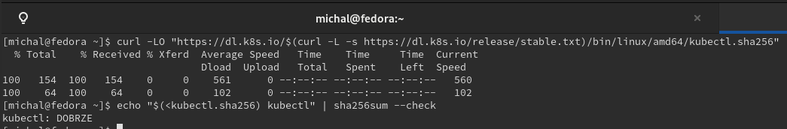
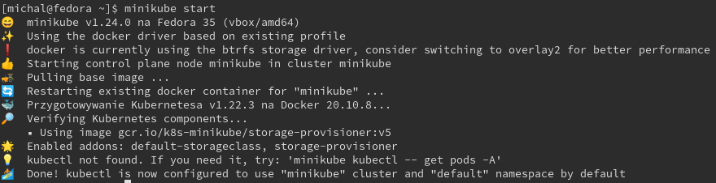
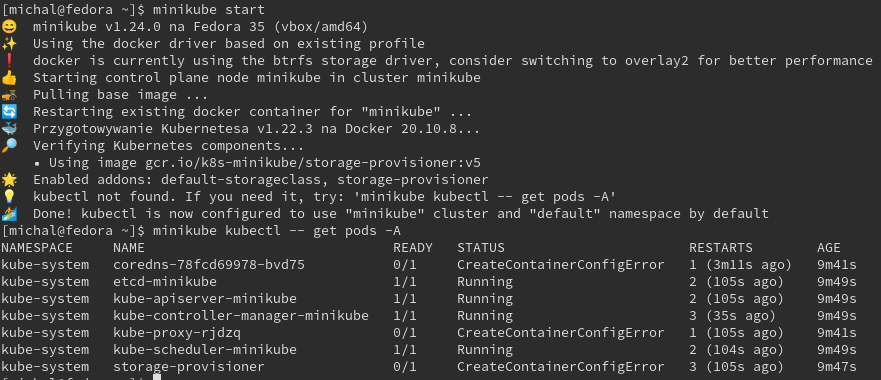
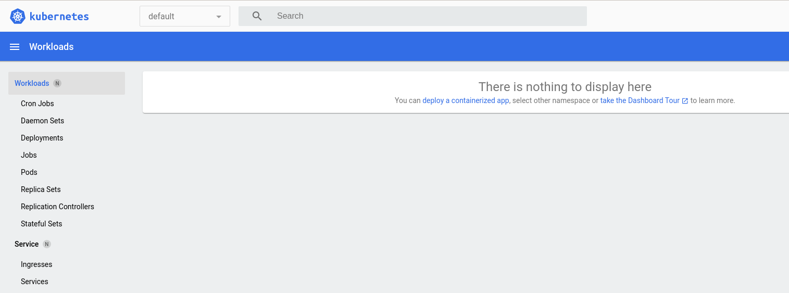
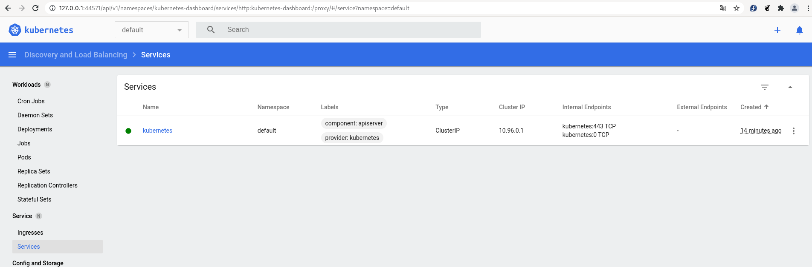

# Zajęcia 05

### Zestawienie platformy Kubernetes

* Upewnij się, że kontener jest dostępny
* Zainstaluj wymagania wstępne dla środowiska Minikube
    
    * ```sudo chmod 666 /var/run/docker.sock```

* Zainstaluj kubectl
  

* sprawdzono czy poprawnie zostało zainstalowane przy użycia pliku sprawdzającego checksum

```curl -LO "https://dl.k8s.io/$(curl -L -s https://dl.k8s.io/release/stable.txt)/bin/linux/amd64/kubectl.sha256"```

```echo "$(<kubectl.sha256)  kubectl" | sha256sum --check```



* Zainstaluj minikube
  * pobrano najnowszą paczkę z minikube
  ```curl -LO https://storage.googleapis.com/minikube/releases/latest/minikube-latest.x86_64.rpm```


* Okazało się, że koniecznie trzeba przydzielić min 2 procesory do virtualnej maszyny Fedora


uruchomiono minicube:





  * Przedstaw uruchomione oprogramowanie wstępne (i usługi)
    * Platforma konteneryzacji
    * Otwarte porty
    * Stan Dockera

### Stan Minikube
* Uruchom Minikube Dashboard
    ```minikube dashboard```
  
* Wyświetl działające usługi (k8s) i wdrożenia
  
* Wyświetl dostępne wdrożenia (stan "przed")
  
* 
  

### Wdrożenie kontenera via k8s
* Wdróż przykładowy deployment "hello k8s": ```k8s.gcr.io/echoserver```
* Użyj ```kubectl run <ctr> --image=<DOCKER_ID>/ --port=<port> --labels app=ctr```
* Przekieruj porty
* Wykaż że wdrożenie nastąpiło
* W przypadku "niemożliwych" wdrożeń, opisz napotkane ograniczenia

### Deployment
* Utwórz plik YAML z "deploymentem" k8s
* Zestaw 4 repliki, opisz zalety i wady takiej liczby
* Zaaplikuj wdrożenie via ```kubectl apply -f plik.yml```
* Wykaż przeprowadzony deployment


