# Zajęcia 05

### Zestawienie platformy Kubernetes
* Upewnij się, że kontener jest dostępny
* Zainstaluj wymagania wstępne dla środowiska Minikube
    
    * ```sudo chmod 666 /var/run/docker.sock```

* Zainstaluj kubectl
  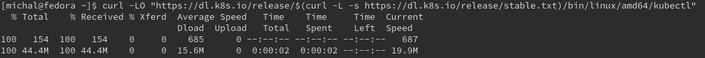

* sprawdzono czy poprawnie zostało zainstalowane przy użycia pliku sprawdzającego checksum

```curl -LO "https://dl.k8s.io/$(curl -L -s https://dl.k8s.io/release/stable.txt)/bin/linux/amd64/kubectl.sha256"```

```echo "$(<kubectl.sha256)  kubectl" | sha256sum --check```

`sudo install -o root -g root -m 0755 kubectl /usr/local/bin/kubectl`

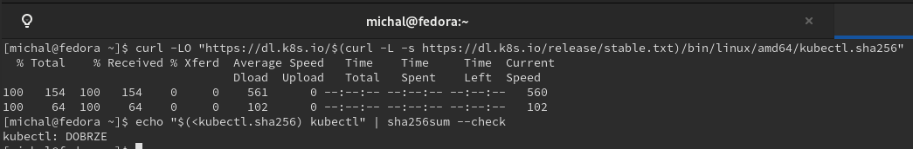

`kubectl version --client`

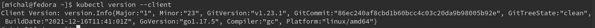


* Zainstaluj minikube
  * pobrano najnowszą paczkę z minikube
  ```curl -LO https://storage.googleapis.com/minikube/releases/latest/minikube-latest.x86_64.rpm```

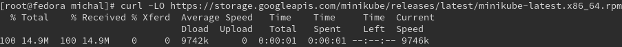

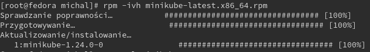

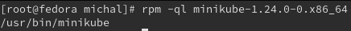

* Okazało się, że koniecznie trzeba przydzielić min 2 procesory do virtualnej maszyny Fedora

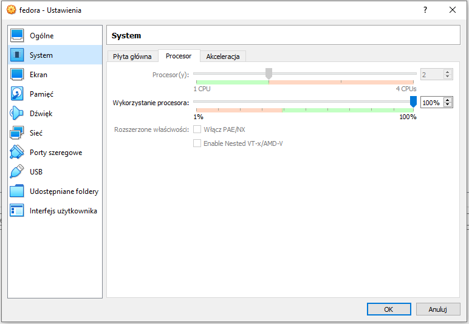

uruchomiono minicube:

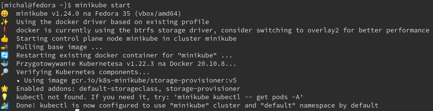

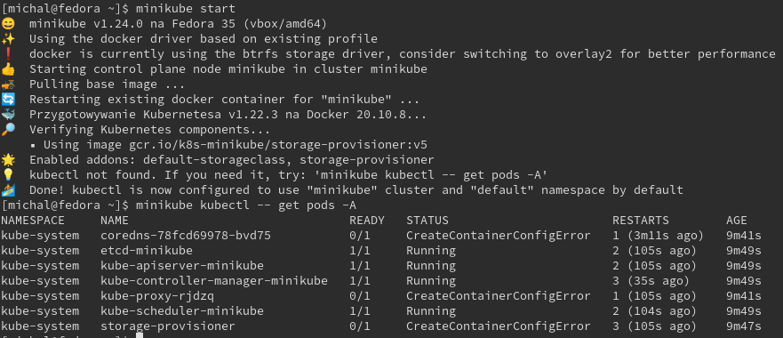

* status minicube

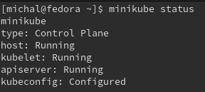

* uruchomione kontenery

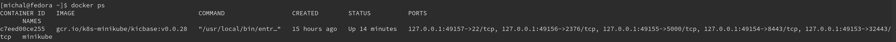

  * Przedstaw uruchomione oprogramowanie wstępne (i usługi)
    * Platforma konteneryzacji
    * Otwarte porty
    * Stan Dockera

### Stan Minikube
* Uruchom Minikube Dashboard
    ```minikube dashboard```

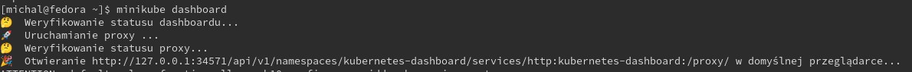

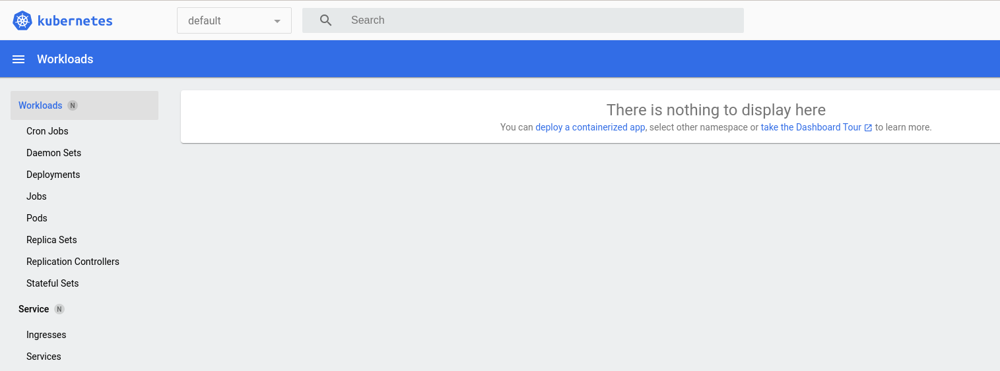
* Wyświetl działające usługi (k8s) i wdrożenia

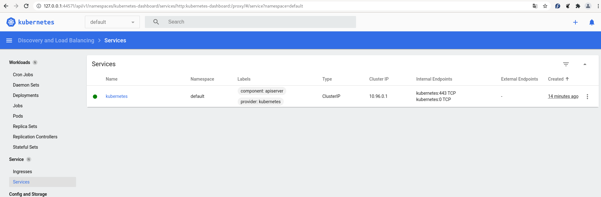

* Wyświetl dostępne wdrożenia (stan "przed")

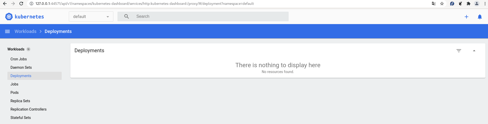

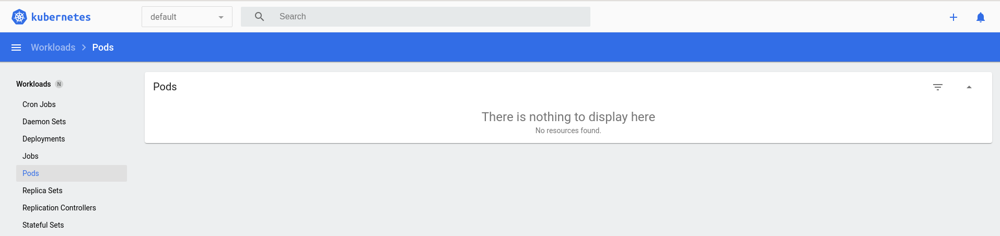

### Wdrożenie kontenera via k8s
* Wdróż przykładowy deployment "hello k8s": ```k8s.gcr.io/echoserver```
* Użyj ```kubectl run <ctr> --image=<DOCKER_ID>/ --port=<port> --labels app=ctr```

`kubectl create deployment hello-minikube --image=k8s.gcr.io/echoserver:1.4`

* Przekieruj porty
`kubectl expose deployment hello-minikube --type=NodePort --port=8080`

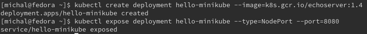

* Wykaż że wdrożenie nastąpiło

kontenery widoczne z fedory:

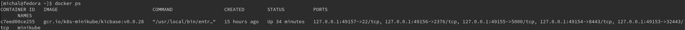

wdrożenie nie jest widoczne z tego poziomu.

Wdrożenie jest widoczne z dashboardu k8s:

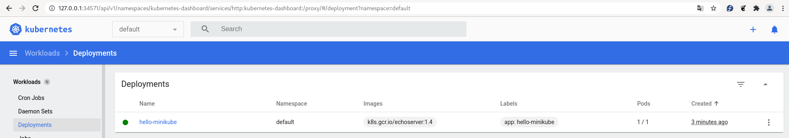

można też podglądnąc wdrożenie przy użyciu `kubectl`

* `kubectl get deployment`
* `kubectl get pods -o wide`
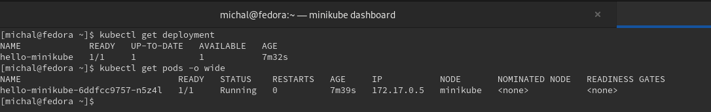

Więcej szczegółów:

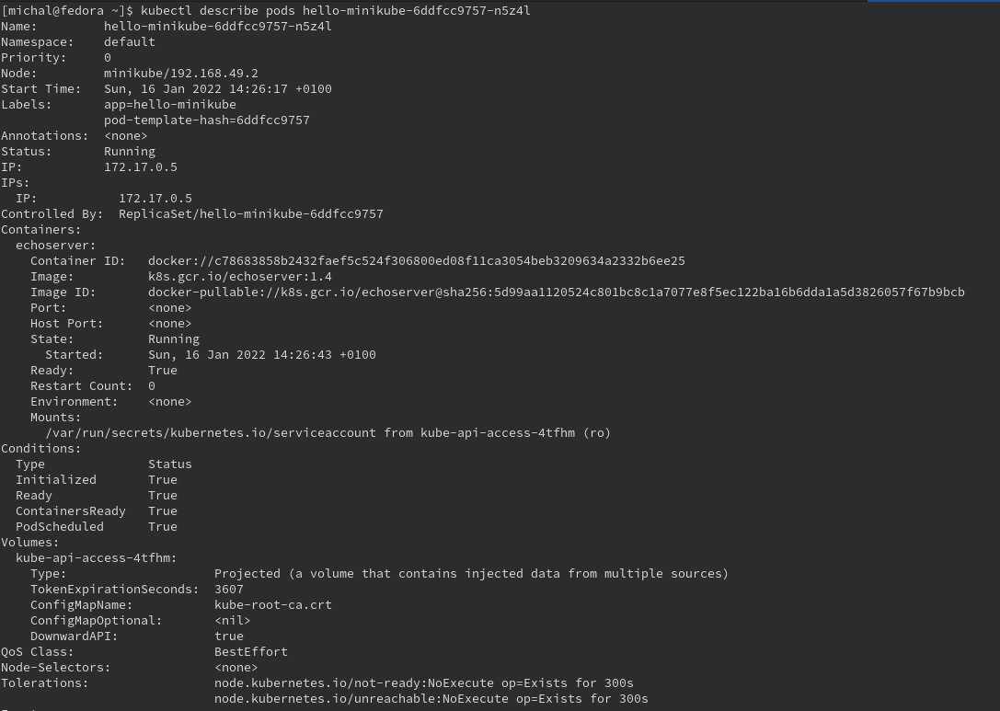
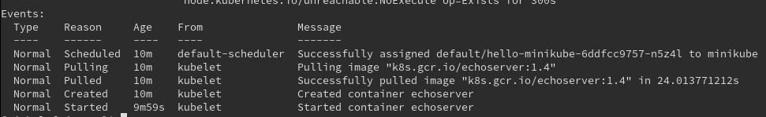


### Deployment
* Utwórz plik YAML z "deploymentem" k8s
* Zestaw 4 repliki, opisz zalety i wady takiej liczby
* Zaaplikuj wdrożenie via ```kubectl apply -f plik.yml```
* Wykaż przeprowadzony deployment


