# Zajęcia 05

### Zestawienie platformy Kubernetes
* Upewniono się, że kontener z poprzednich zajęć działa:

    * obraz z poprzednich zajęć:
      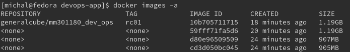

    * sprawdzenie czy buduwanie działa, builder stage:

`docker build -t dev-1.0.0 -f Dockerfile-build .`

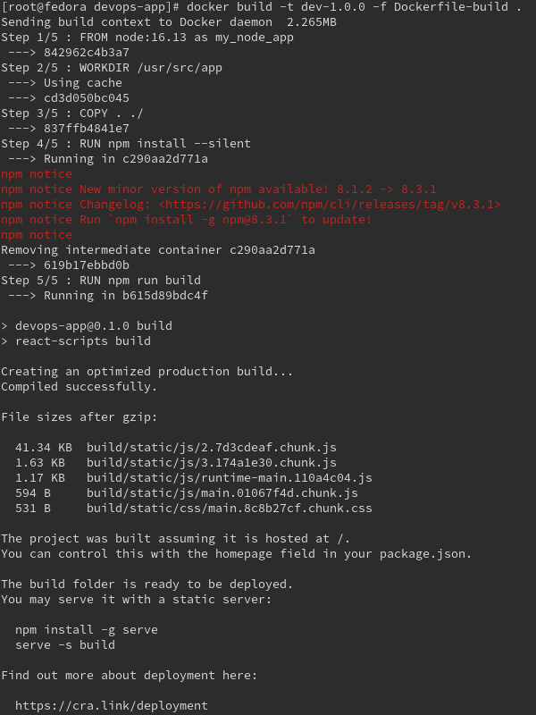

`docker images -a`

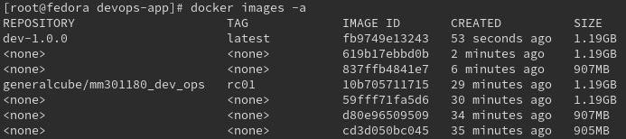

* uruchomienie konterera z obrazu:

`docker run -it -d -p 3301:3306 dev-1.0.0`

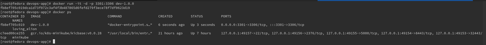

* Wymagania wstępne dla środowiska Minikube:
    
    * ```sudo chmod 666 /var/run/docker.sock```
    * trzeba przydzielić min 2 procesory do virtualnej maszyny Fedora


* Zainstaluj kubectl
  

* sprawdzono czy poprawnie zostało zainstalowane przy użycia pliku sprawdzającego checksum

```curl -LO "https://dl.k8s.io/$(curl -L -s https://dl.k8s.io/release/stable.txt)/bin/linux/amd64/kubectl.sha256"```

```echo "$(<kubectl.sha256)  kubectl" | sha256sum --check```

`sudo install -o root -g root -m 0755 kubectl /usr/local/bin/kubectl`


`kubectl version --client`


* Zainstaluj minikube
  * pobrano najnowszą paczkę z minikube
  ```curl -LO https://storage.googleapis.com/minikube/releases/latest/minikube-latest.x86_64.rpm```


uruchomiono minicube:


* status minicube


* uruchomione kontenery


  * Przedstaw uruchomione oprogramowanie wstępne (i usługi)
    * Platforma konteneryzacji
    * Otwarte porty
    * Stan Dockera
    
    `docker stats --format "table {{.Name}}\t{{.CPUPerc}}\t{{.MemUsage}}"`

### Stan Minikube
* Uruchom Minikube Dashboard
    ```minikube dashboard```


* Wyświetl działające usługi (k8s) i wdrożenia


* Wyświetl dostępne wdrożenia (stan "przed")


### Wdrożenie kontenera via k8s
* Wdrożono przykładowy deployment "hello k8s": ```k8s.gcr.io/echoserver```

`kubectl create deployment hello-minikube --image=k8s.gcr.io/echoserver:1.4`

* Przekierowano porty
`kubectl expose deployment hello-minikube --type=NodePort --port=8080`


* Wykazano, że wdrożenie nastąpiło

kontenery widoczne z fedory:


wdrożenie nie jest widoczne z tego poziomu.

Wdrożenie jest widoczne z dashboardu k8s:


można też podglądnąc wdrożenie przy użyciu `kubectl`

* `kubectl get deployment`
* `kubectl get pods -o wide`
* 


Więcej szczegółów:


### Deployment
* Utwórz plik YAML z "deploymentem" k8s
* Zestaw 4 repliki
* testowo napisano plik dla deploymentu `nginx`

```yaml
apiVersion: apps/v1
kind: Deployment
metadata:
  name: nginx-deployment
  labels:
    app: nginx
spec:
  replicas: 4
  selector:
    matchLabels:
      app: nginx
  template:
    metadata:
      labels:
        app: nginx
    spec:
      containers:
      - name: nginx
        image: nginx:1.14.2
        ports:
        - containerPort: 80
```

* opisz zalety i wady takiej liczby
    * zalety
      * skalowalność, możliwość wykorzystaia laod balancera, 
      który pozowli na zoptymalizowanie działania pod kątem wydajności
      * zwiększona odporność na awarię, w razie jej wystąpienia, 
      k8s'owy deployment będzie dbał aby wszystkie pody się restartowały i żeby były zdrowe
      * zwiększone bezpieczeństwo
    * wady
      * możliwe wysokie koszty utrzymywania 4 replik


* Zaaplikowano wdrożenie

`kubectl apply -f ./nginx-deploy.yaml`


* Pody zaraz po uruchomieniu:
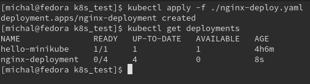


* Przeprowadzony deployment

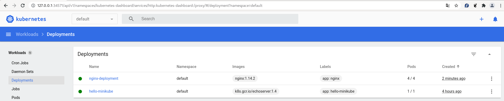

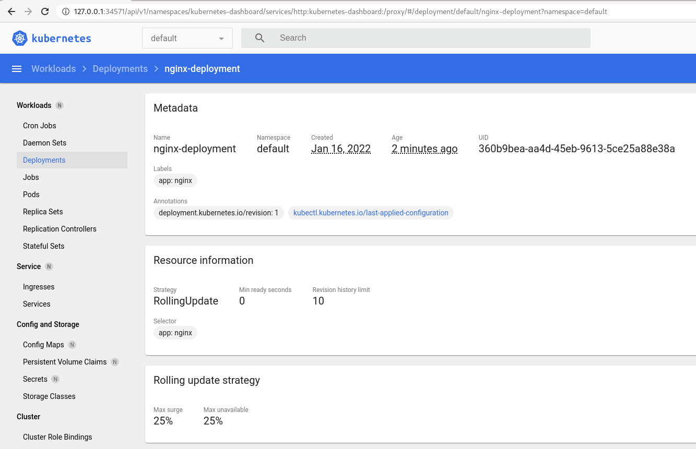

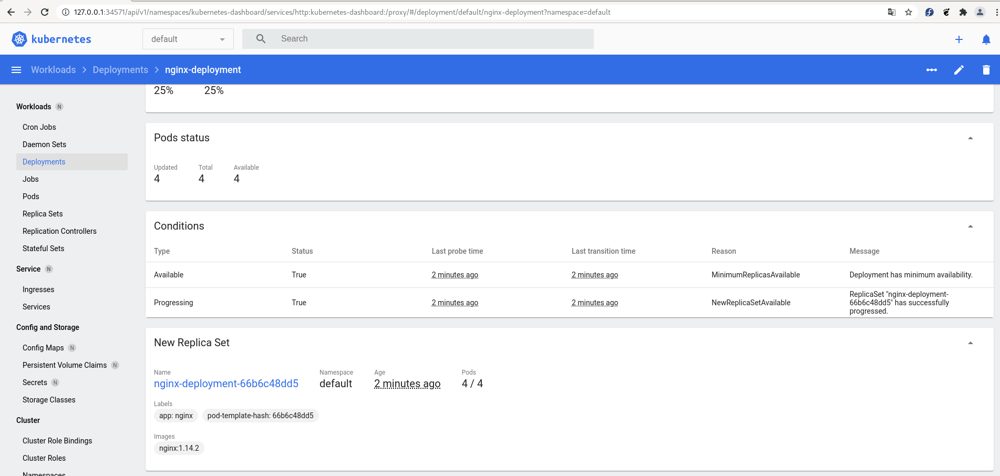

* 4 uruchomione pody, gdy już pody w pełni działają:

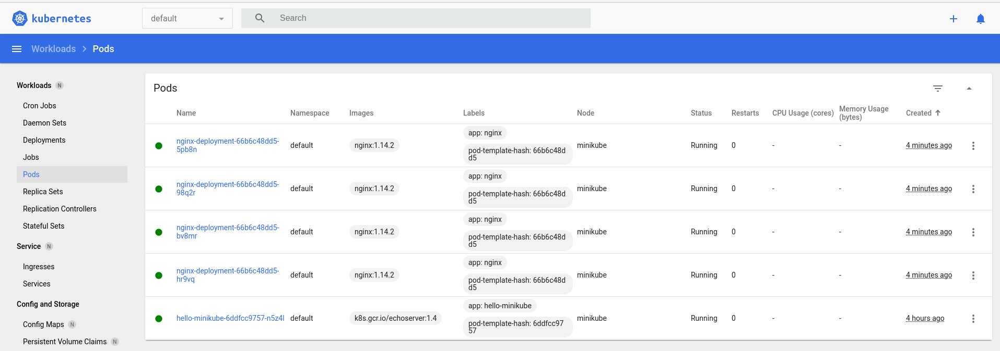
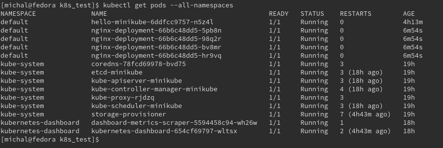

Docker stat:

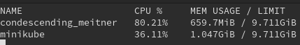
