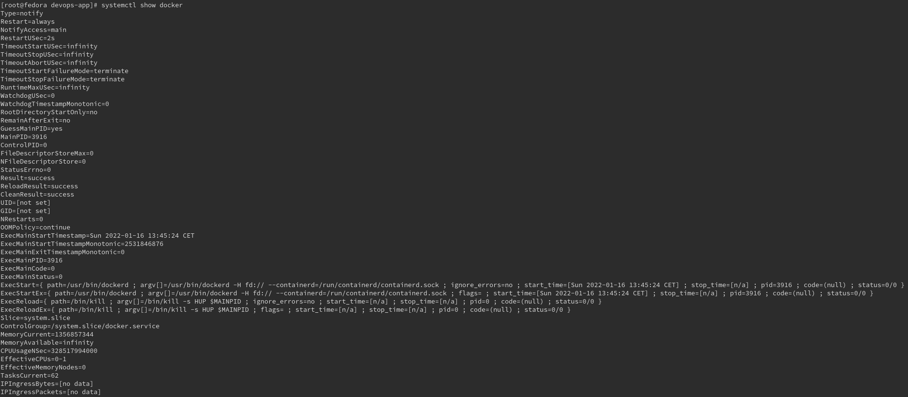
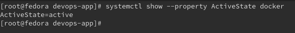
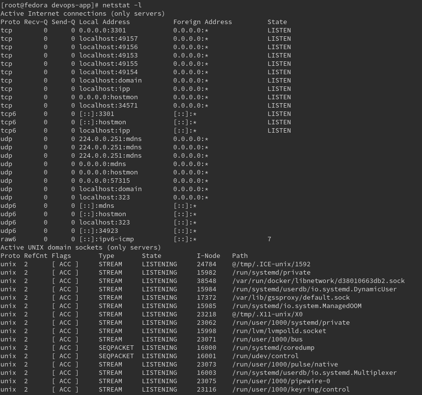

# Zajęcia 05

### Zestawienie platformy Kubernetes
* Upewniono się, że kontener z poprzednich zajęć działa:
  * uruchomiono go ponownie ręcznie.
  * obraz z poprzednich zajęć:


* sprawdzenie czy buduwanie obrazu nadal działa, builder stage:

`docker build -t dev-1.0.0 -f Dockerfile-build .`


* sprawdzenie czy obraz zbudowano poprawnie

`docker images -a`


* uruchomienie konterera z obrazu:

`docker run -it -d -p 3301:3306 dev-1.0.0`


* Wymagania wstępne dla środowiska Minikube:
    
    * ```sudo chmod 666 /var/run/docker.sock```
    * trzeba przydzielić min 2 procesory do virtualnej maszyny Fedora


* Zainstalowano kubectl z `https://dl.k8s.io`

```curl -LO "https://dl.k8s.io/$(curl -L -s https://dl.k8s.io/release/stable.txt)/bin/linux/amd64/kubectl.sha256"```


* sprawdzono czy poprawnie zostało zainstalowane przy użycia pliku sprawdzającego checksum

```echo "$(<kubectl.sha256)  kubectl" | sha256sum --check```

`sudo install -o root -g root -m 0755 kubectl /usr/local/bin/kubectl`


`kubectl version --client`


* zainstalowano minikube
  * pobrano najnowszą paczkę z minikube z storage.googleapis.com

```curl -LO https://storage.googleapis.com/minikube/releases/latest/minikube-latest.x86_64.rpm```


* uruchomiono minicube:


* wyświetlono status minicube


* wyświetlono uruchomione kontenery


* Przedstawiono uruchomione oprogramowanie wstępne
  * Platforma konteneryzacji
    
`systemctl show  docker`



`systemctl show --property ActiveState docker`



  * Otwarte porty

`netstat -l`


    * Stan Dockera

`docker stats --format "table {{.Name}}\t{{.CPUPerc}}\t{{.MemUsage}}"`

### Stan Minikube
* Uruchom Minikube Dashboard
    ```minikube dashboard```


* Wyświetl działające usługi (k8s) i wdrożenia


* Wyświetl dostępne wdrożenia (stan "przed")


### Wdrożenie kontenera via k8s
* Wdrożono przykładowy deployment "hello k8s": ```k8s.gcr.io/echoserver```

`kubectl create deployment hello-minikube --image=k8s.gcr.io/echoserver:1.4`

* Przekierowano porty
`kubectl expose deployment hello-minikube --type=NodePort --port=8080`


* Wykazano, że wdrożenie nastąpiło

kontenery widoczne z fedory:


wdrożenie nie jest widoczne z tego poziomu.

Wdrożenie jest widoczne z dashboardu k8s:


można też podglądnąc wdrożenie przy użyciu `kubectl`

* `kubectl get deployment`
* `kubectl get pods -o wide`
* 


Więcej szczegółów:


### Deployment
* Utwórz plik YAML z "deploymentem" k8s
* Zestaw 4 repliki
* testowo napisano plik dla deploymentu `nginx`

```yaml
apiVersion: apps/v1
kind: Deployment
metadata:
  name: nginx-deployment
  labels:
    app: nginx
spec:
  replicas: 4
  selector:
    matchLabels:
      app: nginx
  template:
    metadata:
      labels:
        app: nginx
    spec:
      containers:
      - name: nginx
        image: nginx:1.14.2
        ports:
        - containerPort: 80
```

* opisz zalety i wady takiej liczby
    * zalety
      * skalowalność, możliwość wykorzystaia laod balancera, 
      który pozowli na zoptymalizowanie działania pod kątem wydajności
      * zwiększona odporność na awarię, w razie jej wystąpienia, 
      k8s'owy deployment będzie dbał aby wszystkie pody się restartowały i żeby były zdrowe
      * zwiększone bezpieczeństwo
    * wady
      * możliwe wysokie koszty utrzymywania 4 replik


* Zaaplikowano wdrożenie

`kubectl apply -f ./nginx-deploy.yaml`


* Pody zaraz po uruchomieniu:


* Przeprowadzony deployment


* 4 uruchomione pody, gdy już pody w pełni działają:


Docker stat:


## Zajęcia 06 : zależność ciągłej integracji od komponentów stron trzecich

### Inwentaryzacja
* Zdefiniuj w ramach stworzonego Dockerfile'a zależności platformowe
    * Node JS
    * NPM
* Oprogramowanie, które doinstalowujesz aby uruchomić program
    * Docker

* W razie braku zależności (np. obraz ```node``` i aplikacje wymagająca tylko ```node```), "zależnością" jest sam obraz

Zależności platformowe:

https://github.com/michalmuchakr/docker-react-test-app

* repozytorium, na podstawie którego tworzony jest deployowany artefakt samodzielnie zarządza pakietami instalowanymi,
  należy zadbać, aby w środowisku uruhomieniowym była dostępna odpowiednia wersja NPM oraz NODE
* to samo tyczy się bazowego obrazu na podstawie, którego budowany jest obraz.
* Podejście to zostało wybrane, mając na uwadze, możliwość podzielenia obowiązków pomiędzy zespół developerski oraz zespół devOps'owy:
    * zespół developerski - odpowiada za aktualizowanie zależności oraz stworzenie
      gotowego do wdrożenia obraz aplikacji oraz deployment na środowiska dev, oraz QA
    * zespół devOps - jest odpowiedzialny za deployment aplikacji na środowiska UAT oraz prod

* Określ okoliczności, w których uzasadnione jest przebudowywanie i aktualizacja obrazu po wydaniu nowej wersji którejś z zależności

    * jeżeli nowa wersja obrazu bazowego zawiera łatki bezpieczeństwa, które w naszym przypadku poprawiają bezpieczeństwo
    * Konsekwencją uaktualnienia wesji bazowej obrazu jest wykorzystanie nowszej wersji Node,
      co umożliwia wykorzystanie nowszych funkcji bez konieczności stosowania tzw. polyfills

* Czy należy to robić "zawsze"?

    * aktualizacjąc obraz, wersję NODE, należy się upewnić, że nasza aplikacja, po uaktualnieniu, nadal będzie działać sprawnie, bez błędów.
    * istnieje czasem możliwość, że część funkcjonalności, która była dostępna wcześniej została przez twórców porzucona,
      zastąpoina inną, to może za sobą ponosić ryzyko błędów oraz zwiększać "koszt" czasowy uaktualniania wersji
    * nowa wersja NODE może nie zawierać żadnych unowocześnień oraz łatek bezpieczeństwa, które dotyczą naszej implementatacji,
      zatem jej wdrażanie może być bezcelowe, a konsekwencji być stratą czasu

* Jakie są przesłanki (i jak je ustalić) wskazujące na konieczność aktualizacji
    * Można wykorzystać narzędzia do statycznej lub dynamicznej analizy kodu pod kątem bezpieczeństwa
        * https://www.veracode.com/
    * Można ręcznie sprawdzać biblioteki narzędziami online:
        * https://nvd.nist.gov/vuln/search
        * npm outdated

* Jakie jest ryzyko aktualizowania/nieaktualizowania (im dokładniejszy przykład, tym lepiej)
* Pytanie pomocnicze: czy obraz Fedory/Ubuntu na dockerhubie jest aktualizowany dla każdej nowej wersji pakietu wchodzącego w jego skład? Dlaczego tak/nie?

### Wdrożenie

Z tego co wiem kredyty się nie odnawiają, zatem zosawiam sobie na pracę inżynierską

Alternatywnie do zadania wyżej: określenie zależności od dostawcy chmurowego
* Określ poziom zależności wdrożenia od środowiska chmurowego
* Zweryfikuj dostępność studenckiego konta Azure i **zapoznaj się z cennikiem**
* Przeprowadź próbne wdrożenie obrazu w ramach dostępnych kredytów
* Zatrzymaj i usuń kontener, i wstrzymaj storage space, aby nie generować rachunków na pustych przebiegach

Z tego co wiem kredyty się nie odnawiają, zatem zosawiam sobie na pracę inżynierską
jako bonus zrobiłem wdrożenie wykorzystując GitLab do nelify:

netlify:
- 

zmienne środowiskowe gitLab:

- 


.gitlab-ci.yml

``` yaml
stages:
  - test
  - build
  - deploy

tester project:
  stage: test
  image: node:15
  script:
    - yarn install
    - yarn test

builder project:
  stage: build
  image: node:15
  script:
    - yarn install
    - yarn build
  artifacts:
    paths:
      - build/

deployer project:
  stage: deploy
  image: node:15
  script:
    - npm i netlify-cli -g
    - netlify deploy --dir=build --prod

```

Zdeployowana aplikacjia:
https://boring-jang-9c06f9.netlify.app/

Repo GitLab:
https://gitlab.com/michalmm/test-react-project

- 
