# Zajęcia 03

#### Łączność i woluminy na podstawie "złych" praktyk

- Pobierz obraz Ubuntu
  `docker pull ubuntu`
- Podłącz wolumin do kontenera
  `docker volume create secret-data`
  `docker run -it --mount source=secret-data,destination=/store ubuntu`
- Utwórz plik w kontenerze, na obszarze woluminu, pokaż na hoście
  `cd store`
  `touch tajne-logi-z-kontenera.txt`
  `exit`
  wyświetl plik z poziomu docker desktop lub `ls -a /var/lib/docker/volumes/secret-data/_data`

#### "Kiepski pomysł": SSH

- Uruchom i wyeksponuj wybrany port w kontenerze
  Znajdź port ssh na hoście:
  `grep -i port /etc/ssh/sshd_config`
  `docker run -it --mount source=secret-data,destination=/store --publish 2222:{znalezionyPort} ubuntu`
- Zainstaluj w kontenerze serwer ssh
  `apt-get update`
  `apt-get -y install openssh-server`
- zezwól na logowanie root
  `edytuj plik sshd_config`
  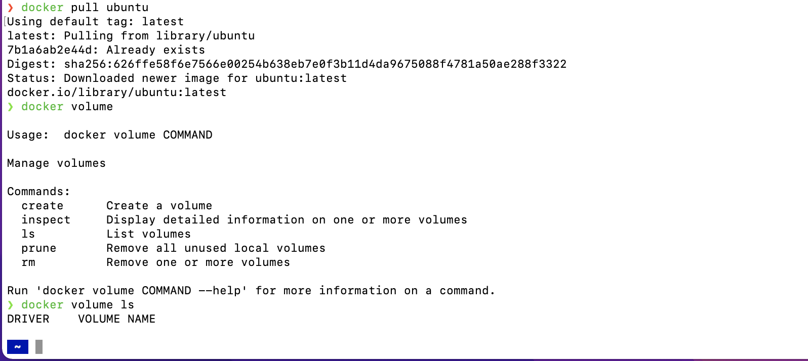
- umieść klucz publiczny w woluminie, skopiuj go do pliku zaufanych w kontenerze
  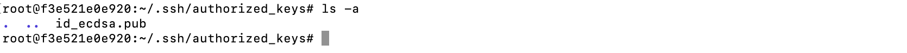
- odnajdź adres IP kontenera w wewnętrznej sieci
  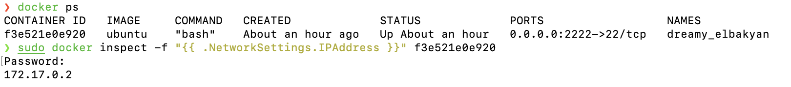
- uruchom usługę, połącz się z kontenerem
  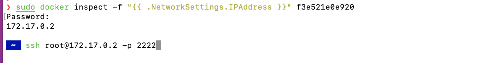

#### Skonteneryzowany Jenkins stosujący Dockera

#### Przygotowanie

- Upewnij się, że Dockerfiles i Docker Compose z poprzednich zajęć są w repozytorium
- Zapoznaj się z instrukcją https://www.jenkins.io/doc/book/installing/docker/
  - Uruchom obraz Dockera który eksponuje środowisko zagnieżdżone
    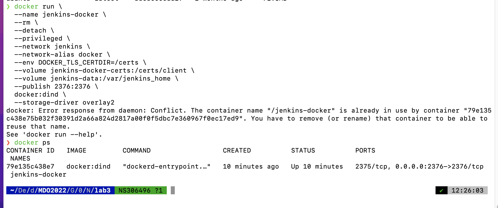
  - Przygotuj obraz blueocean na podstawie obrazu jenkinsa
    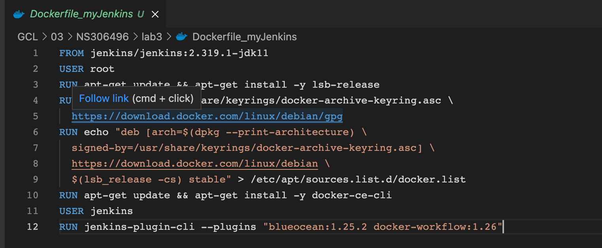
  - Uruchom blueocean
    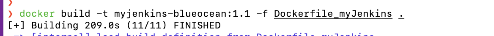
  - Zaloguj się i skonfiguruj Jenkins
    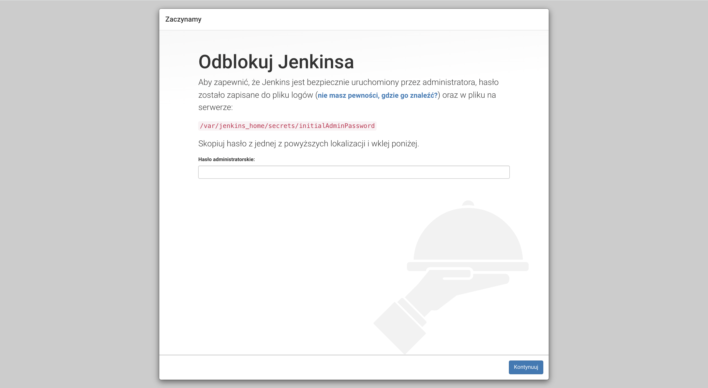
    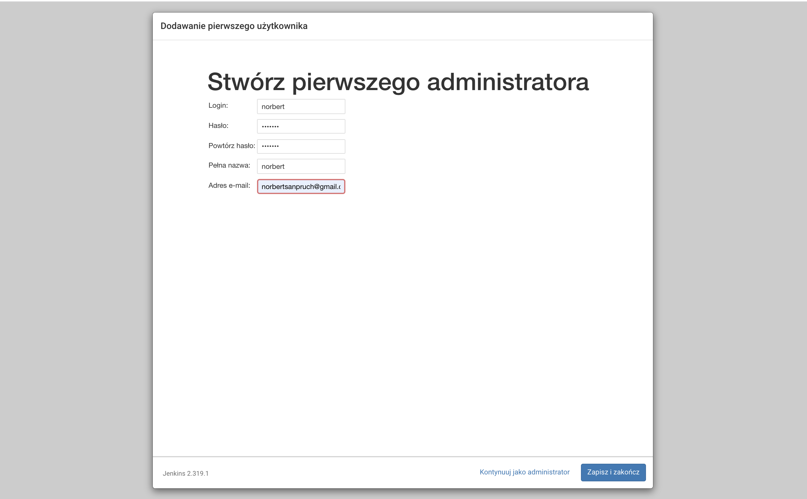

#### Mikro-projekt Jenkins

- Utwórz projekt, który wyświetla uname
  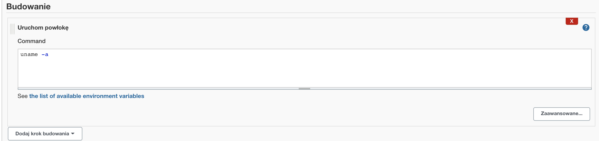
  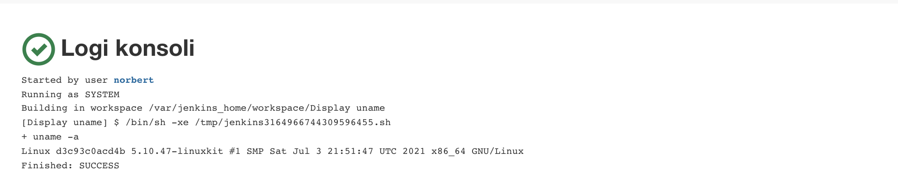
- Utwórz projekt, który zwraca błąd, gdy... godzina jest nieparzysta
  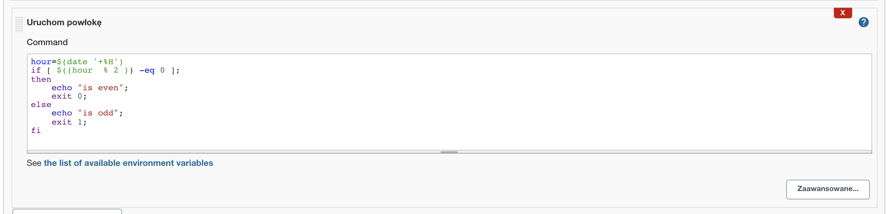
  
- Utwórz "prawdziwy" projekt, który:
  - klonuje nasze repozytorium
    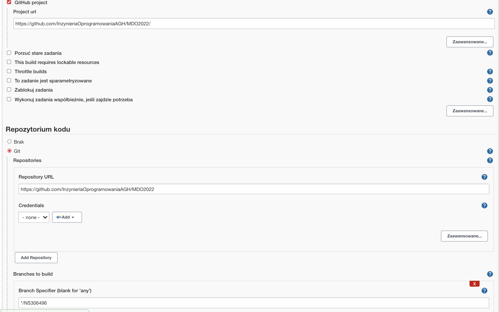
  - przechodzi na osobistą gałąź
    Ustawione na powyzszym zrzucie ekranu
  - buduje obrazy z dockerfiles i/lub komponuje via docker-compose
    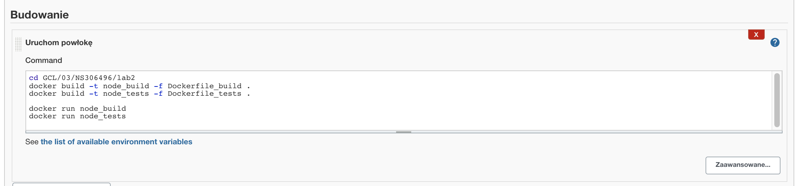

Lista stworzonych projektów
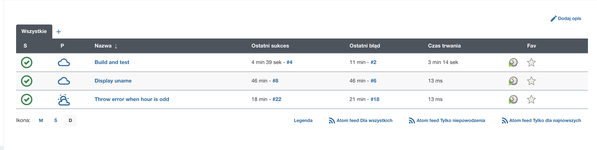
