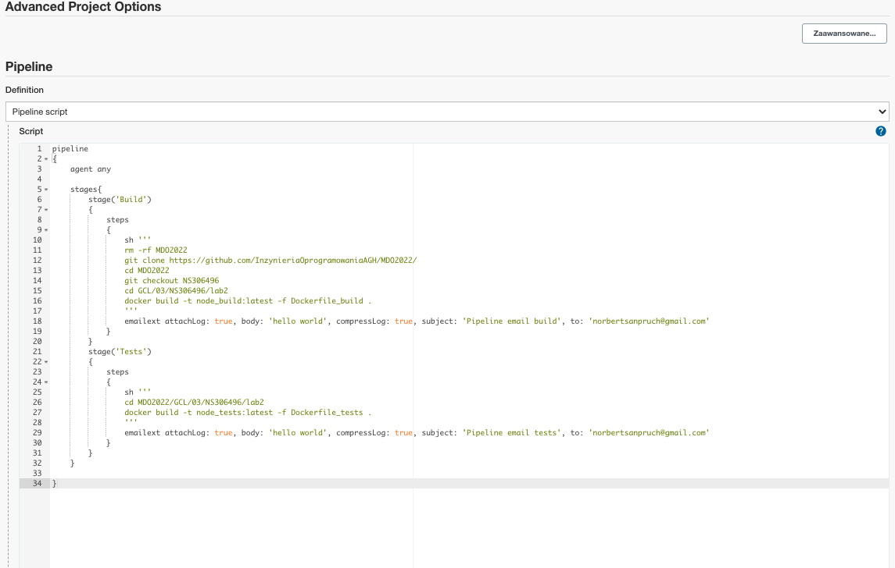
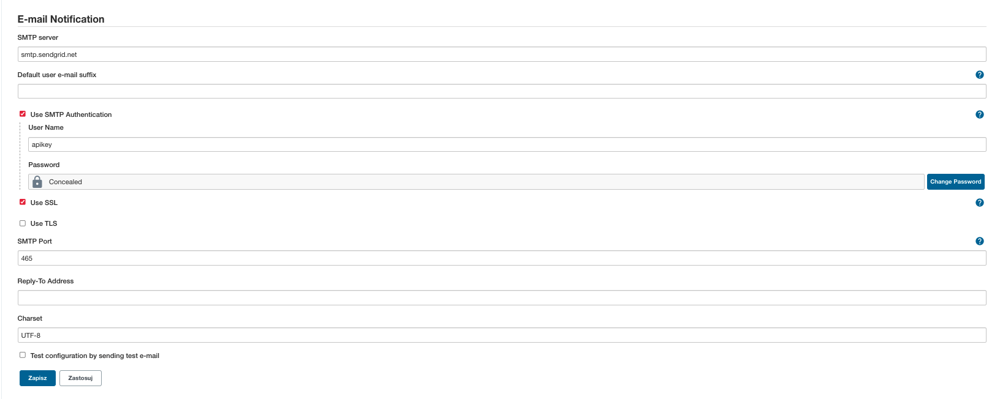
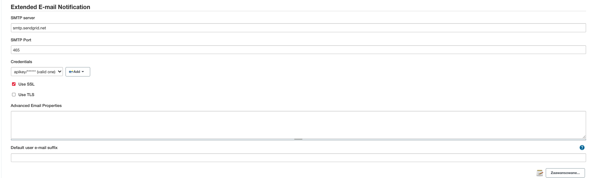

# Zajęcia 04

## Wprowadzenie

### Zapewnij dostępność plików w gałęzi

- skrypty, Docker files, kompozycje (jeżeli są), Jenkinsfile
- dostępne w odpowiedniej gałęzi i katalogu w MDO2022

### Stwórz Jenkinsfile: opis

- Utwórz nowy pipeline budujący wybraną aplikację, oparty o Jenkinsfile
- Docelowo, ma zawierać etapy "Build" i "Test"
- Przejściowo, może zawierać jeden etap "Build + Test"
- Może, ale nie musi, budować się na dedykowanym DIND, ale może się to dziać od razu na kontenerze CI. Należy udokumentować funkcjonalną różnicę między niniejszymi podejściami
- Początkowo, Jenkinsfile może być albo "wklejony" albo dodany do repozytorium, które jest sforkowane, to znaczy:
- albo pipeline zawiera treść Jenkinsfile'a
- albo forkujemy repozytorium wybranej aplikacji i dodajemy Jenkinsfile do niego

### Jenkinsfile: przebieg

https://www.jenkins.io/doc/book/pipeline/jenkinsfile/

- Przykładowe zbiory czynności w Jenkinsfile:
  Jednokrokowy pipeline (Build i test), pobierający narzędzie docker-compose i uruchamiajacy docker compose up na kompozycji z poprzednich zajęć
  - build + test
    - download docker-compose
    - compose up
  - build
    - git pull
    - npm install
    - npm build
  - test
    - npm test

### Jenkinsfile: powiadomienia

- Sekcja "post" dla każdego stage'a, informująca mailem o rezultacie

---

# Realizacja

1. Uruchom dockerowe obrazy DIND oraz jenkins-blueocean - instruckje zawarte są w sprawozdaniu 3
2. Stwórz nowy projekt i wybierz "Pipeline"
3. Umieść ponizszy kontent jako Jenkinsfile w sekcji "Pipeline"
   
   skrypt zawiera dwa etapy "Build" i "Tests"
4. Załóz konto na app.sendgrid.com oraz wygeneruj SMTP api key
5. Skonfiguruj sekcje "Email notification" oraz "Extended email notification" w ustawieniach jenkinsa (Manage Jenkins > Configuration)
   
   
6. Uruchom pipeline. Wygenerowane logi:
   
7. Otrzymane maile
   

Pipeline nie buduje się na dedykowanym DIND, lecz na kontenerze CI poniewaz jest to prostsze rozwiazanie pozwalajace uniknac dodatkowej konfiguracji.

Zastosowanie kontenera DIND dałoby większą kontrolę i izolacje środowiska wraz z agentem.
