# Metodyki DevOps - sprawozdanie - zajęcia 03

## Łączność i woluminy na podstawie "złych" praktyk

### Pobranie obrazu Ubuntu

Aby pobrać obraz Ubuntu dla Dockera, należy wykonać następującą komendę:

`docker pull ubuntu`

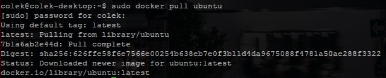

### Podłączenie woluminu do kontenera

Aby podpiąć wolumin do kontenera, najpierw musimy utworzyć katalog, który będzie naszym woluminem - na przykład:

`mkdir /media/exthdd1/DockerVolume`

Następnie podczas uruchamiania kontenera, musimy zastosować flagę `-v <ścieżka lokalna>:<ścieżka w kontenerze>` - na przykład:

`docker run -it -v /media/exthdd1/DockerVolume:/media/DockerVolume ubuntu`

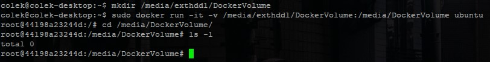

### Kopiowanie/przenoszenie plików z hosta do woluminu

Aby skopiować plik, który chcemy, aby był dostępny z poziomu naszego kontenera, musimy go skopiować/przenieść do woluminu, który jest podpięty pod kontener.

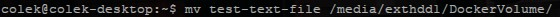

Teraz plik, który skopiowaliśmy/przenieśliśmy do woluminu, będzie dostępny z poziomu naszego kontenera.

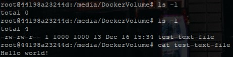

### Kopiowanie/przenoszenie plików z kontenera do woluminu

Sytuacja wygląda analogicznie w drugą stronę - jeżeli skopiujemy/przeniesiemy plik, który jest dostępny w naszym kontenerze do woluminu, będzie on dostępny z poziomu hosta.

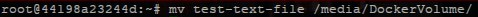

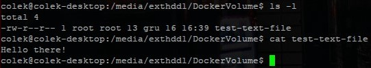

## "Kiepski pomysł": SSH

### Eksponowanie portów 

Aby wyeksponować port z naszego kontenera, musimy dodać flagę `-p <port na hoście>:<port z dockera>` - na przykład:

`docker run -it -v /media/exthdd1/DockerVolume:/media/DockerVolume -p 9999:9999 ubuntu`

Jeżeli port, którego chcieliśmy użyć jest już wykorzystany przez inną aplikację, otrzymamy błąd.

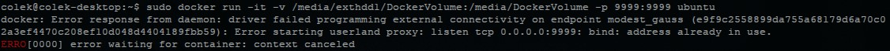

Wtedy musimy albo zmienić port, który chcieliśmy wyeksponować, albo zamknąć aplikację, która aktualnie z niego korzysta i blokuje nam dostęp.

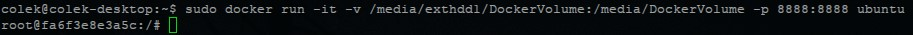

### Instalacja serwera SSH

Aby zainstalować na kontenerze stworzonym na podstawie czystego obrazu Ubuntu, musimy wykonać następującą komendę:

`apt update && apt install openssh-server -y`

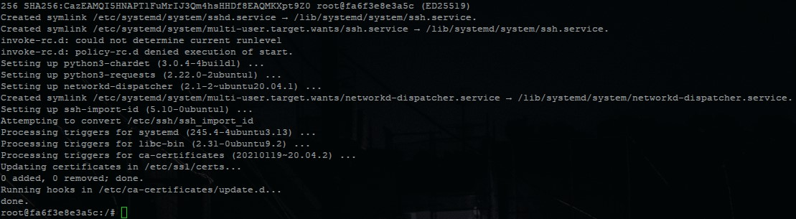

### Zmiana portu serwera SSH

Domyślnie SSH jest uruchomione na porcie 22 - jeżeli chcemy wyeksponować serwis na zewnątrz, musimy skierować go pod port, który sprecyzowaliśmy przy tworzeniu kontenera - w naszym przypadku jest to `8888`.

Ponieważ na podstawowym obrazie Ubuntu nie mamy zainstalowanego edytora plików tekstowych, instalujemy `nano`.

`apt install nano`

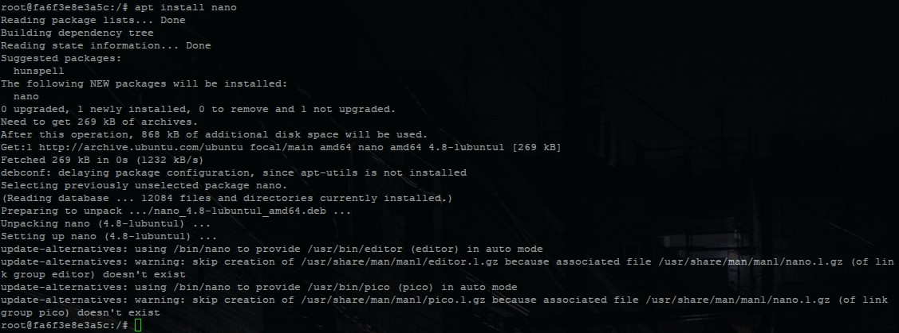

Ścieżka, pod którą dostępny jest plik konfiguracyjny serwera OpenSSH to `/etc/ssh/sshd_config`. Uruchamiamy edytor `nano` na tym pliku:

`nano /etc/ssh/sshd_config`

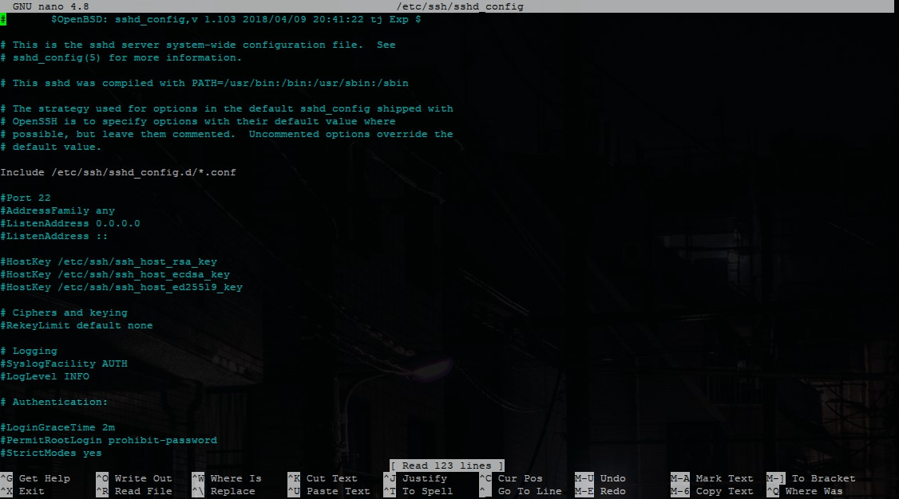

Za pomocą edytora, zmieniamy port z `22` na `8888`, usuwamy znak odpowiedzialny za odkomentowanie linijki `#` i zapisujemy plik.

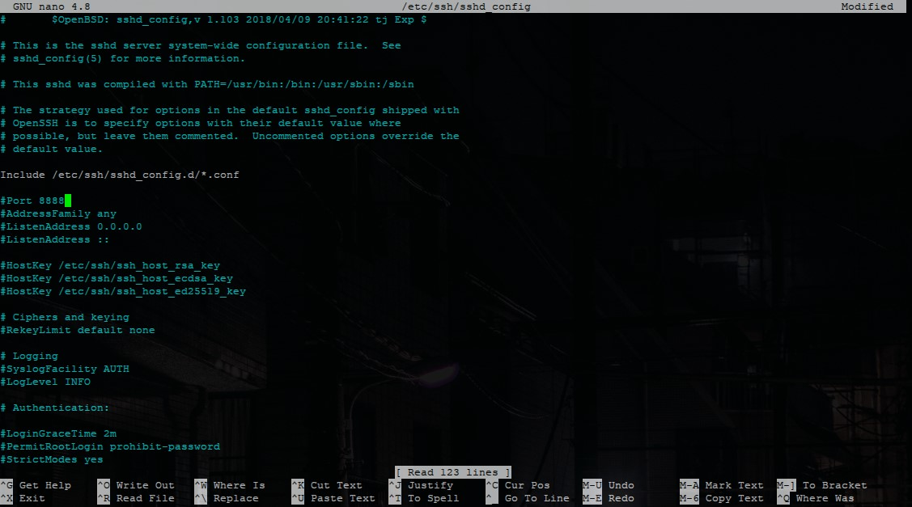

### Zezwalanie na logowanie root

Proces wygląda tak samo jak w poprzednim opisanym kroku - natomiast zamiast zmieniać linijkę dotyczącą portu, szukamy linijki z tekstem `PermitRootLogin` i zmieniamy jej wartość na `yes`.

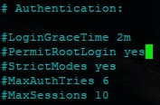

### Dodawanie kluczy publicznych do kontenera za pomocą woluminu

Musimy skopiować klucz publiczny, za pomocą, którego chcemy się uwierzytelnić do naszego woluminu.

`cp ~/.ssh/id_ed25519.pub /media/exthdd1/DockerVolume/`

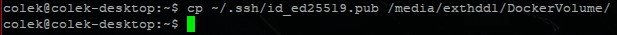

Następnie z poziomu naszego kontenera, dodajemy skopiowany klucz publiczny do zaufanych.

Najpierw tworzymy katalog `/root/.ssh`, a następnie kopiujemy do niego nasz klucz jako `authorized_keys`.

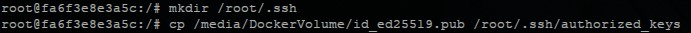

### Adres IP kontenera

Aby odnaleźć nasz adres IP kontenera, możemy na hoście wywołać komendę:

`docker inspect <ID kontenera> || grep IPAddress`.

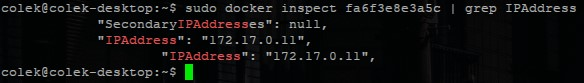

### Uruchamianie usługi SSH na kontenerze

Aby uruchomić daemon'a usługi SSH, musimy wykonać następującą komendę:

`/usr/sbin/sshd -D &`

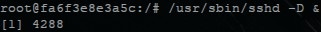

Jeżeli otrzymamy błąd o brakującym folderze `/run/sshd`, musimy go utworzyć przez `mkdir`.

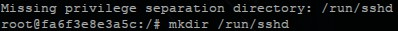

### Połączenie z kontenerem przez SSH

Gdy wszystko jest już skonfigurowane poprawnie, możemy połączyć się z naszym kontenerem przez hosta komendą:

`ssh root@<IP kontenera> -p <port wystawiony>`

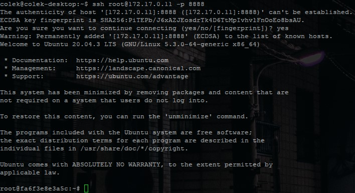

## Skonteneryzowany Jenkins stosujący Dockera

### Uruchamianie obrazu Dockera, który eksponuje środowisko zagnieżdżone
### Na podstawie instrukcji - https://www.jenkins.io/doc/book/installing/docker/

Tworzymy nowy mostek sieciowy o nazwie `jenkins`:

`docker network create jenkins`

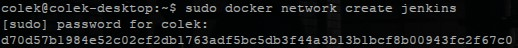

Uruchamiamy nowy kontener - jeżeli brakuje nam obrazu `docker:dind`, zostanie on automatycznie pobrany:

    docker run --name jenkins-docker --rm --detach \
    --privileged --network jenkins --network-alias docker \
    --env DOCKER_TLS_CERTDIR=/certs \
    --volume jenkins-docker-certs:/certs/client \
    --volume jenkins-data:/var/jenkins_home \
    --publish 2376:2376 docker:dind --storage-driver overlay2

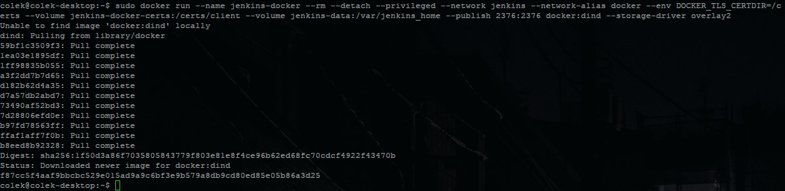

### Tworzenie obrazu **blueocean** na podstawie obrazu **jenkins**

Tworzymy nowy Dockerfile dla **blueocean**:

    FROM jenkins/jenkins:2.319.1-jdk11
    USER root
    RUN apt-get update && apt-get install -y lsb-release
    RUN curl -fsSLo /usr/share/keyrings/docker-archive-keyring.asc \
    https://download.docker.com/linux/debian/gpg
    RUN echo "deb [arch=$(dpkg --print-architecture) \
    signed-by=/usr/share/keyrings/docker-archive-keyring.asc] \
    https://download.docker.com/linux/debian \
    $(lsb_release -cs) stable" > /etc/apt/sources.list.d/docker.list
    RUN apt-get update && apt-get install -y docker-ce-cli
    USER jenkins
    RUN jenkins-plugin-cli --plugins "blueocean:1.25.2 docker-workflow:1.26"

I buildujemy nowy obraz:

`docker build -t myjenkins-blueocean:1.1 .`

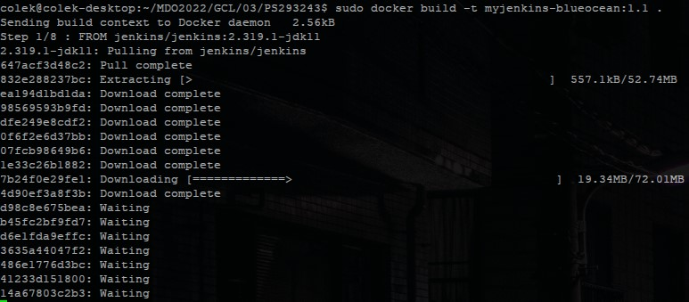
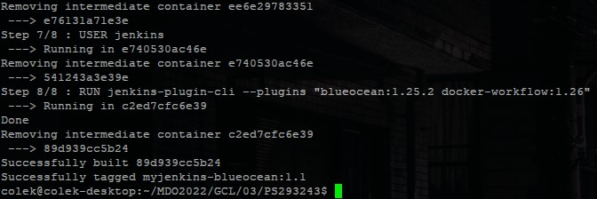

### Uruchomienie **blueocean**

Gdy mamy już zbudowany obraz **blueocean**, możemy go uruchomić:

    docker run --name jenkins-blueocean --rm --detach \
    --network jenkins --env DOCKER_HOST=tcp://docker:2376 \
    --env DOCKER_CERT_PATH=/certs/client --env DOCKER_TLS_VERIFY=1 \
    --publish 8080:8080 --publish 50000:50000 \
    --volume jenkins-data:/var/jenkins_home \
    --volume jenkins-docker-certs:/certs/client:ro \
    myjenkins-blueocean:1.1

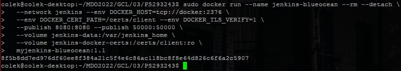

Przechodzimy do przeglądarki i udajemy się pod adres http://localhost:8080/

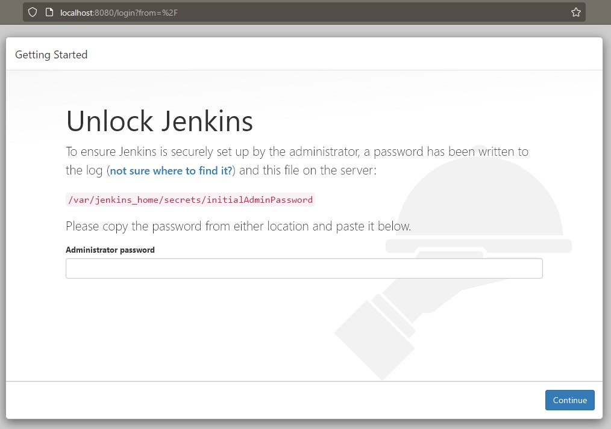

Jeżeli pracujemy na innym komputerze, niż ten, gdzie uruchomiony jest Jenkins, musimy dodatkowo ustawić przekierowanie portów.

W moim przypadku, ustawiłem to w kliencie SSH `KiTTY`, z którego korzystam.

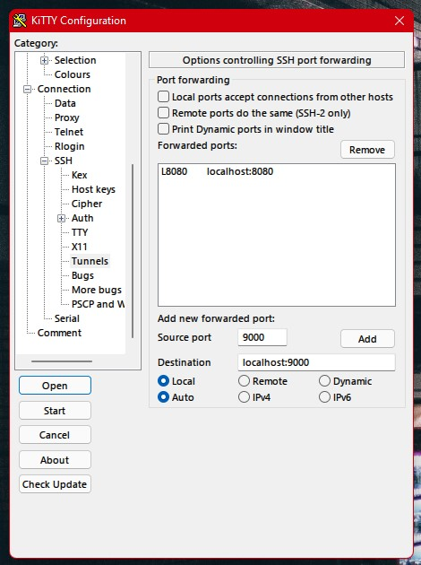

### Logowanie i konfiguracja Jenkinsa

Ścieżka do pliku, w którym znajduje się hasło do Jenkinsa, jest nam pokazana po wejściu na stronę w przeglądarce. Zawartość tego pliku możemy zwrócić przez wykonanie komendy w kontenerze:

`cat /var/jenkins_home/secrets/initialAdminPassword`

Na przykład:

`sudo docker exec e13c3e83aefa cat /var/jenkins_home/secrets/initialAdminPassword`

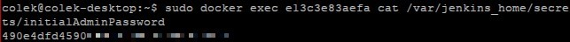

Po zalogowaniu hasłem, które właśnie otrzymaliśmy, przechodzimy do konfiguracji Jenkinsa.

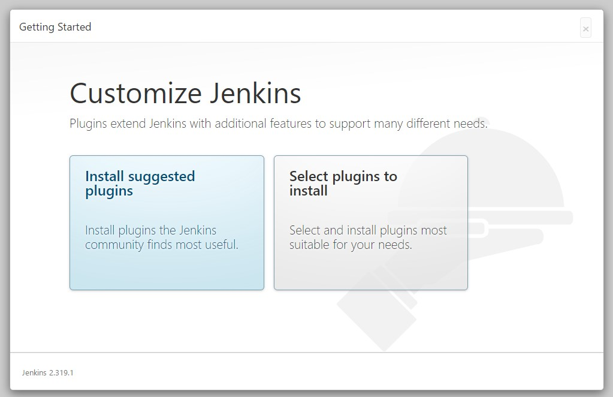

Po wstępnej konfiguracji przeniesieni zostaniemy do ekranu głównego.

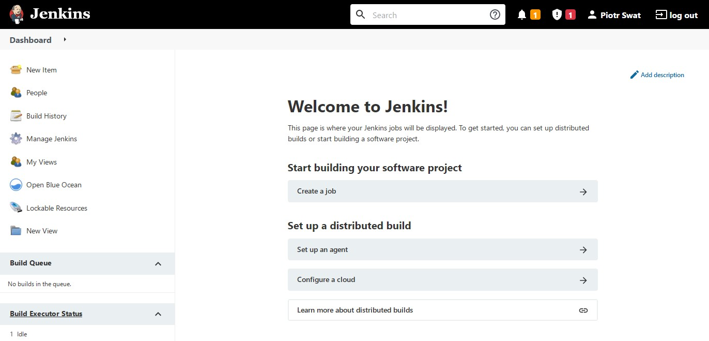

## Mikro-projekt Jenkins

### Projekt wyświetlajacy **uname**

Z menu dostępnego po lewej stronie wybieramy opcję **New Item**.

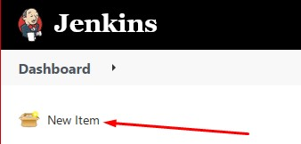

Wpisujemy nazwę naszego projektu - w tym przypadku będzie to `uname` i wybieramy **Freestyle project**. Klikamy **OK**.

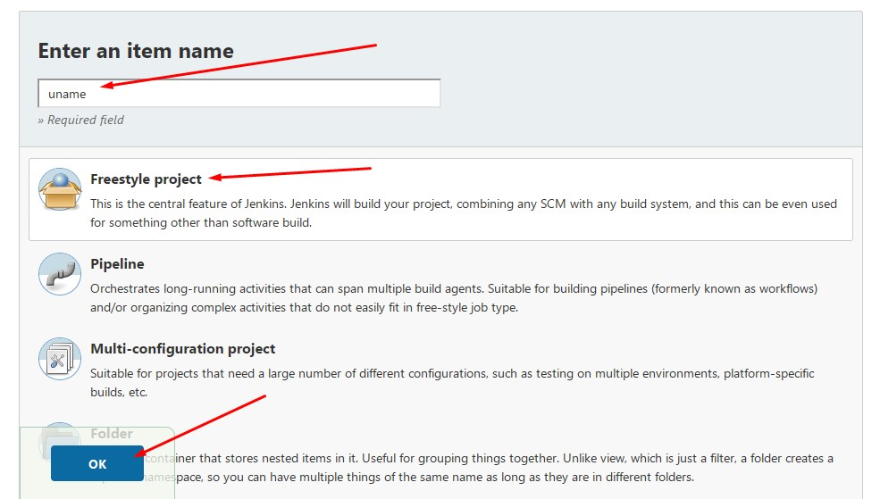

Przechodzimy do **Build**. Klikamy **Add build step** i wybieramy opcję **Execute shell**. W polę komendy wpisujemy `uname -a`. Wciskamy przycisk **Save**.

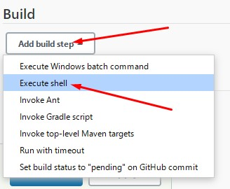

W menu po lewej stronie ekranu klikamy **Build Now**.

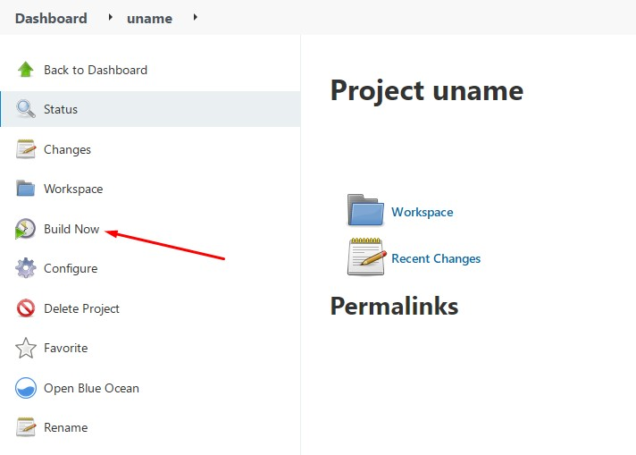

Przechodzimy do **Build History** i wybieramy naszego builda.

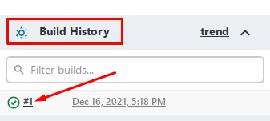

Klikamy na **Console Output** i wyświetli nam się wynik działania naszego builda - czyli to, co zwróciła nam komenda `uname -a`.

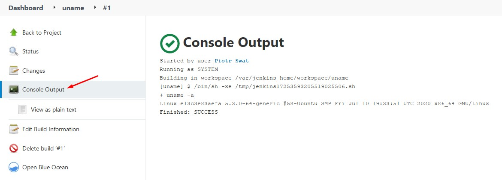

### Projekt zwracający błąd, gdy aktualna godzina jest nieparzysta

Tworzymy nowy projekt **Freestyle project**.

Przechodzimy do **Build**. Klikamy **Add build step** i wybieramy opcję **Execute shell**. W polę komendy podajemy poniższy skrypt:

    #!/bin/bash

    hour=$(date +%H)
    echo $hour

    if [ $((hour%2)) -eq 0 ];
    then

    exit 0

    else

    exit 1

    fi

Wciskamy przycisk **Save**.

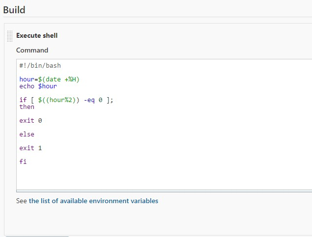

Uruchamiamy builda i sprawdzamy wyjście.

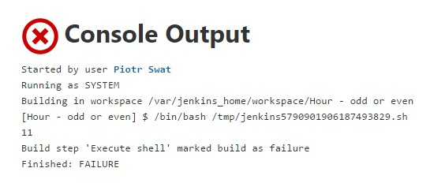
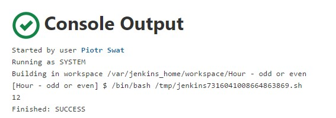

### Projekt "prawdziwy"

Zadaniem naszego prawdziwego projektu będzie sklonowanie naszego repozytorium, przejście na osobistą gałąź i zbudowanie obrazów na podstawie docker-compose.

Najpierw instalujemy wtyczkę, która pozwoli nam na dodanie kroku do builda na podstawie naszego docker-compose.

Przechodzimy do **Dashboard**, **Manage Jenkins** i następnie **Manage Plugins**. Tam klikamy na zakładkę **Available** i wyszukujemy wtyczki **Docker Compose Build Step**, którą instalujemy.

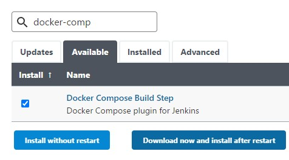

Żebyśmy mieli obsługę docker-compose na naszym Jenkinsie, musimy zainstalować go w skontenerowanym Dockerze.

Wykonujemy kolejno komendy:

`sudo docker exec -u 0 <ID kontenera> curl -L "https://github.com/docker/compose/releases/download/1.29.2/docker-compose-$(uname -s)-$(uname -m)" -o /usr/local/bin/docker-compose`

`sudo docker exec -u 0 <ID kontenera> chmod +x /usr/local/bin/docker-compose`

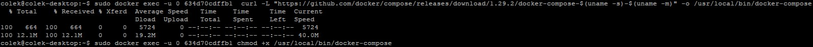

W ustawieniach projektu pod **Source Code Management** podajemy adres do naszego repozytorium oraz nazwę gałęzi.

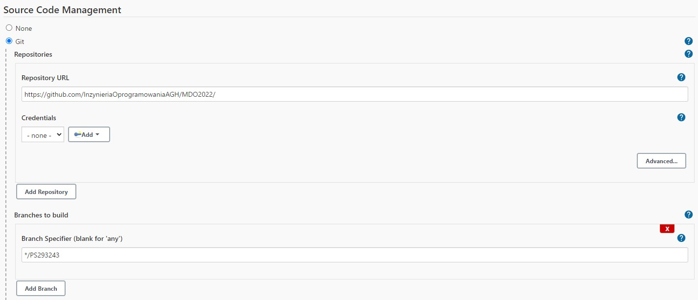

Pod **Build** dodajemy nowy krok - **Docker Compose Build Step** i podajemy ścieżkę do naszego `docker-compose.yml`.

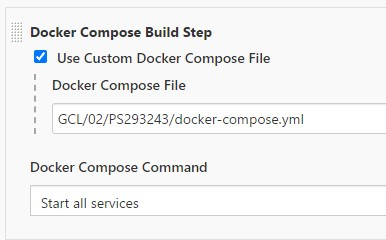

Zapisujemy projekt i uruchamiamy go.

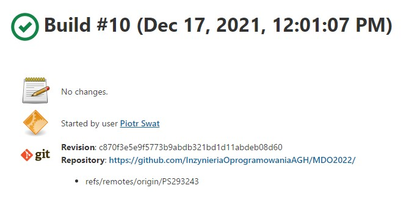

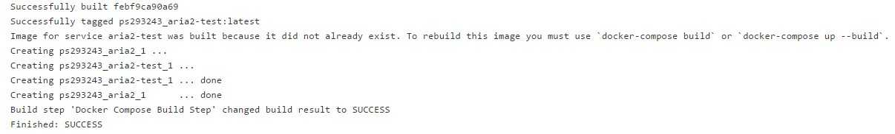