# Zajęcia 05
## Kilka rad zanim zaczniesz
- Niniejsza instrukcja zakłada pracę pod systemem Windows z zainstalowanym WSL2
- Aby korzystać z docker'a pod WSL2 należy zainstalować aplikację [Docker Desktop for Windows ](https://hub.docker.com/editions/community/docker-ce-desktop-windows)
- Będziemy korzystali z Kubernetesa za pośrednictwem Docker Desktop for Windows

## Kroki
### Zestawienie platformy Kubernetes
1. Instalacja Kubernetes pod Docker Desktop

    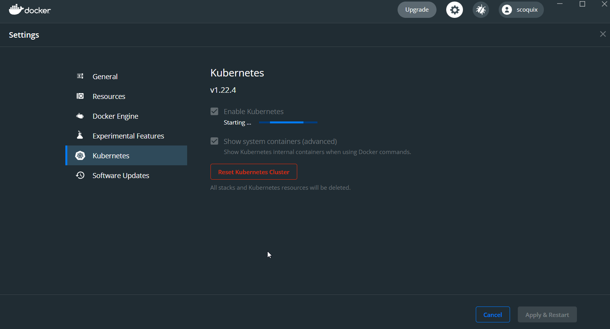
    
2. Zainstaluj wymagania wstępne dla środowiska Minikube
    - Korzystając z WSL2 nie ma potrzeby instalacji Minikube'a
    - Polecenie kubectl jest wystarczające do dalszych kroków
    - Jeśli jednak chcielibyśmy zainstalować Minikube'a możemy skorzystać z następującego [tutoriala](https://www.virtualizationhowto.com/2021/11/install-minikube-in-wsl-2-with-kubectl-and-helm/)
3. Zainstaluj minikube i kubectl 
    - Potwierdzenie instalacji poprzez wyświetlenie wersji 
    - Polecenie: `kubectl version` 
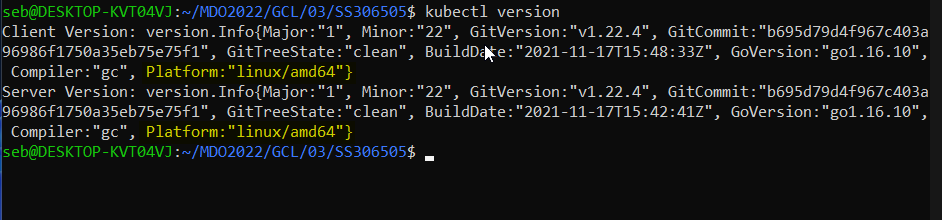

4. Przedstaw uruchomione oprogramowanie wstępne (i usługi)
    - Platforma konteneryzacji \
    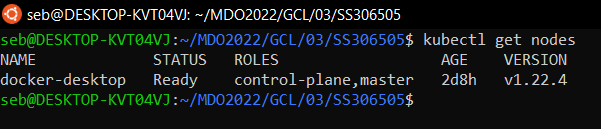
    - Otwarte porty \
    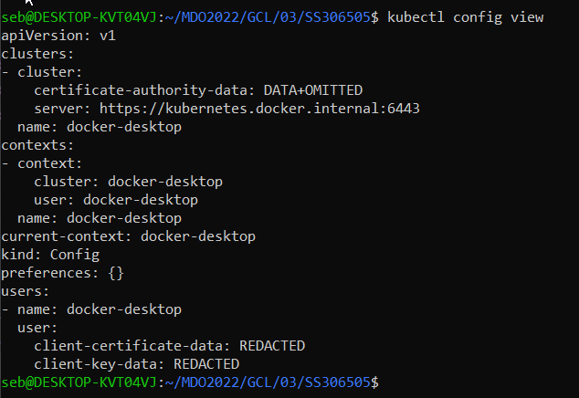
    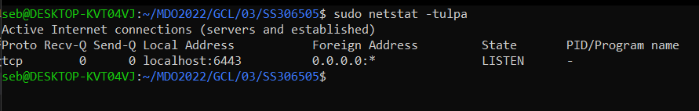
    - Stan Dockera \
    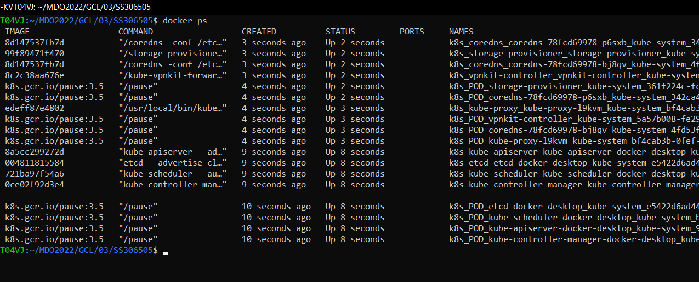

### Stan Minikube
1. Uruchom Minikube Dashboard
    - Zamiast Dashboard'a Minikube'a możemy wyświetlić konkretne obiekty k8s używając kubectl np: \
    `kubectl get pods`
2. Wyświetl działające usługi (k8s) i wdrożenia
    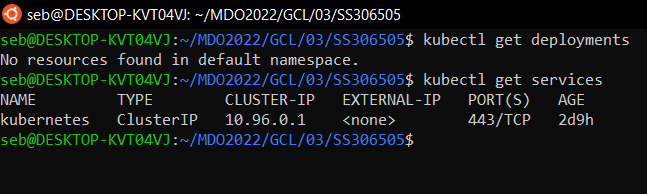
    
### Wdrożenie kontenera via k8s
1. Wdróż przykładowy deployment "hello k8s": k8s.gcr.io/echoserver. \
Możemy użyć np. polecenia: \
`kubectl create deployment hello-node --image=k8s.gcr.io/echoserver:1.4`
2. Użyj `kubectl run <ctr> --image=<DOCKER_ID>/ --port=<port> --labels app=ctr` \
    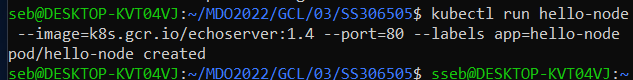
3. Przekieruj porty \
    Można to zrobić na kilka sposobów:
    - Używając polecenia `run` z flagą `--port` (patrz punkt poprzedni)
    - Używając polecenia `expose` np: \
    `kubectl expose deployment hello-node --type=NodePort --port=8080`
    
4. Wykaż że wdrożenie nastąpiło
    - Skorzystamy z polecenia `get pods`
    - Jeśli chcemy szczegółowy opis danego obiektu można użyć polecenie `describe` np:\
    `kubectl describe pod hello-node` \
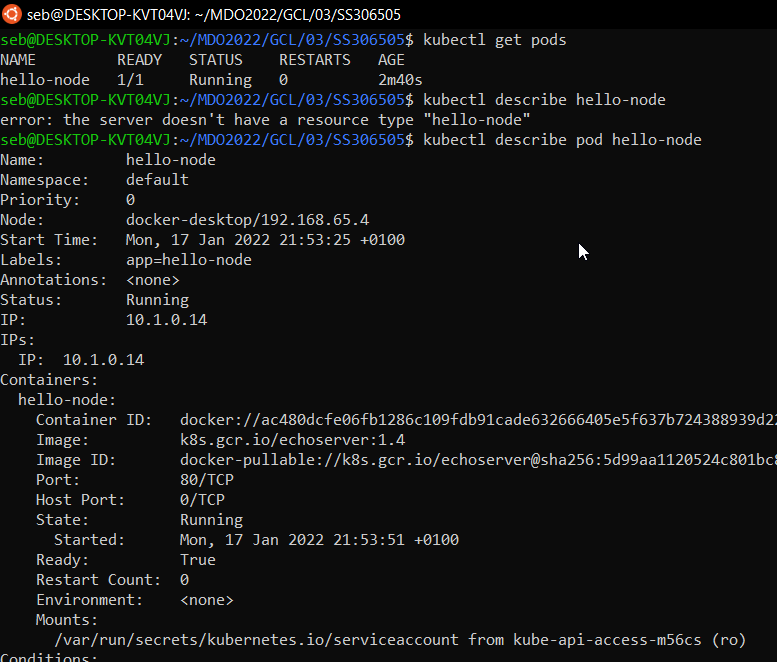

5. W przypadku "niemożliwych" wdrożeń, opisz napotkane ograniczenia
    - Ograniczeniami we wdrożeniach mogą być zasoby dostępne na środowisku produkcyjnym
    - Nawet korzystając z zasobów chmurowych powinniśmy badać ich zużycie aby nie przestraszyć się po ujrzeniu miesięcznego rachunku za usługi
### Deployment
1. Utwórz plik YAML z "deploymentem" k8s
    - Utworzono plik 05_client-deployment.yaml
2. Zestaw 4 repliki, opisz zalety i wady takiej liczby
    ```YAML
    apiVersion: apps/v1
    kind: Deployment
    metadata:
        name: client-deployment
    spec:
        replicas: 4
        selector:
            matchLabels:
                component: web
    template:
        metadata:
            labels:
                component: web
        spec:
            containers:
              - name: client
                image: stephengrider/multi-client
                ports:
                  - containerPort: 3000
    ```
    Wady:
    - W przypadku małego ruchu nie potrzebne zużycie zasobów
    - Jeśli w obrazie wystąpi problem wszystkie repliki będą się z nim zmagać

    Zalety:
     - Łatwość wdrożenia
     - Łatwość utrzymania
     - Możliwość szybkiej zmiany liczby replik

3. Zaaplikuj wdrożenie via kubectl apply -f 
plik.yml \
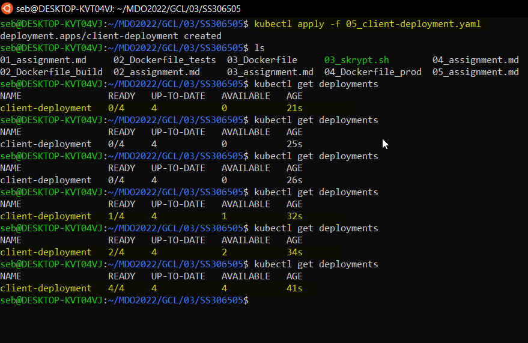
4. Wykaż przeprowadzony deployment \
Użyjemy polecenia `docker ps` aby pokazać że konetery się uruchomiły \
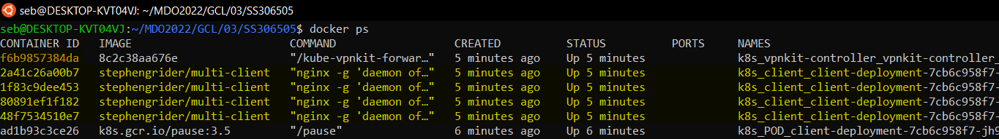

# Zajęcia 06 : Zależność ciągłej integracji od komponentów stron trzecich
## Inwentaryzacja
- Zdefiniuj w ramach stworzonego Dockerfile'a zależności platformowe
    - Biorąc pod uwagę Dockerfile'a produkcyjnego (04_Dockerfile_prod) jest on zależny od wersji node'a oraz wersji OS-a w tym przypadku Alpine
- Oprogramowanie, które doinstalowujesz aby uruchomić program
    - Aby uruchomić program należy zainstalować Docker'a
    - Wewnątrz kontenera produkcyjnego nie jest instalowane żadne dodatkowe oprogramowanie
- W razie braku zależności (np. obraz node i aplikacje wymagająca tylko node), "zależnością" jest sam obraz
    - Zgadza się, jak opisałem wyżej ogranicza nas jedynie wersja obrazu i OS-a z jakiego korzysta
- Określ okoliczności, w których uzasadnione jest przebudowywanie i aktualizacja obrazu po wydaniu nowej wersji którejś z zależności
    - Naprawa podatności security na którą cierpiał obraz w obecnej wersji
    - EOL technologii, która jest obecnie używana przez obraz
    - Chęć użycia nowych możliwości bibliotek w celu optymalizacji działania aplikacji
- Czy należy to robić "zawsze"?
    - NIE, należy robić to tylko jeśli mamy konkretne biznesowe uzasanienie np. naprawa luki bezpieczeństwa
    - Jeśli nie wprowadzmy żadnej wartości dodatniej taka aktualizacja tylko zabierze nam cenny czas
- Jakie są przesłanki (i jak je ustalić) wskazujące na konieczność aktualizacji
    - Zapewnienie bezpieczeństwa
    - Chęć optymalizacji czasu pracy aplikacji
- Jakie jest ryzyko aktualizowania/nieaktualizowania (im dokładniejszy przykład, tym lepiej)
    - Ryzyko aktualizowania:
        - Brak kompatybilności wstecznej pomiędzy wersjami np. python, php-symphony
        - Dodatkowy (niepotrzebny) wysiłek zespołu
        - Ryzyko wprowadzenia Buga/Defektu w nowej wersji
        
    - Ryzyko nieaktualizowania:
        - Wrażliwość na ataki (jeśli ustalimy że jest to możliwe)
        - Brak supportu w wypadku osiągnięcia EOL przez którąś z zależności
     
- Pytanie pomocnicze: czy obraz Fedory/Ubuntu na dockerhubie jest aktualizowany dla każdej nowej wersji pakietu wchodzącego w jego skład? Dlaczego tak/nie?
    - Obrazy nie są aktualizowane, ponieważ mają one zawierać tylko niezbędne do działania komponenty systemu
    - Obrazy są aktualizowane np. jeśli wprowadzona zostaje nowa wersja kernela usprawniająca prace systemu
## Wdrożenie
Alternatywnie do zadania wyżej: określenie zależności od dostawcy chmurowego

- Określ poziom zależności wdrożenia od środowiska chmurowego
    - Duża część konfiguracji hostów jest zapewniana przez dostawce chmury
    - Dostawcy chmury często mają już gotowe/łatwe do utworzenia środowiska produkcyjne np. Kuberneter w GCL (gcloud)
    - Chmura jest środowiskiej które może mieć dostęp do internetu toteż jest to mniej bezpieczne niż środowiska zamknięte w wewnętrznej sieci
- Zweryfikuj dostępność studenckiego konta Azure i zapoznaj się z cennikiem
    - Konto studenckie na platformie Azure jest dostępne dla każdego studenta AGH
    - Przez 30 dni mamy do wykorzystania 200$ \
    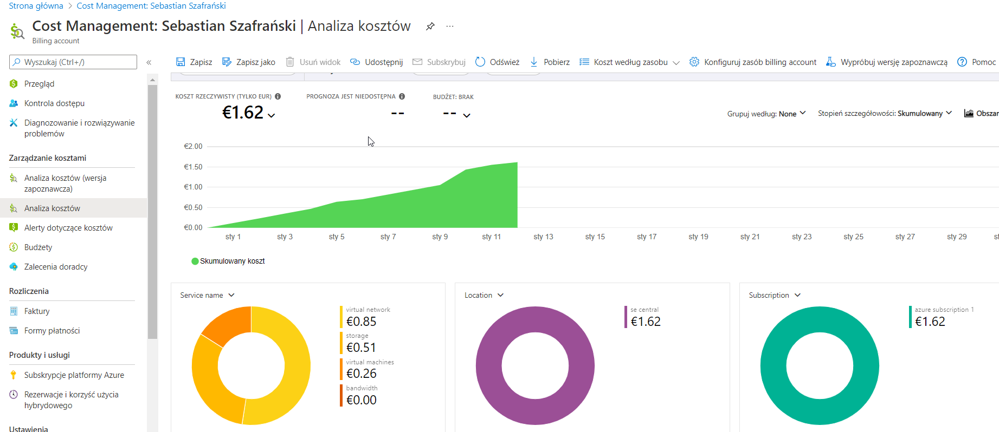
- Przeprowadź próbne wdrożenie obrazu w ramach dostępnych kredytów
    - Niestety nie posiadam już kredytów, jednakże w ramach laboratorium 4 udało mi się przeprowadzić podobne wdrożenie \
    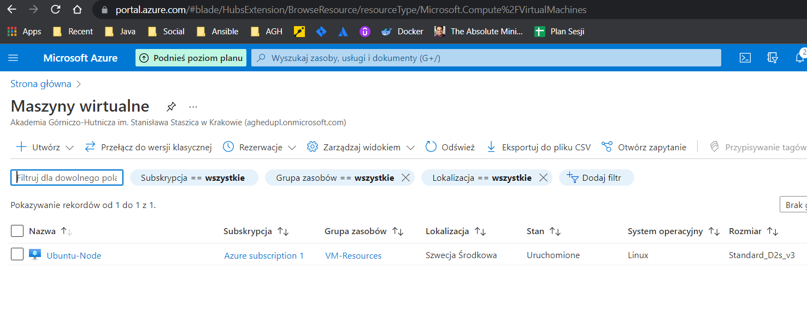
- Zatrzymaj i usuń kontener, i wstrzymaj storage space, aby nie generować rachunków na pustych przebiegach
    - Zawsze powinniśmy pamiętać o czyszczeniu środowisk chmurowych, które nie są już przez nas używane
    - Azure w przeciwieństwie do AWS zatrzymuje usługi jeśli nasz darmowy budżet zostanie przekroczony