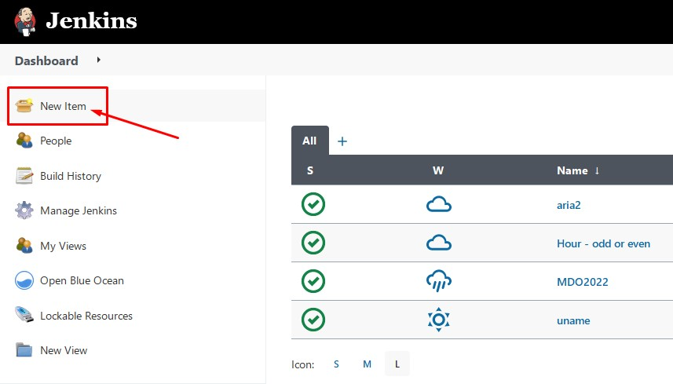
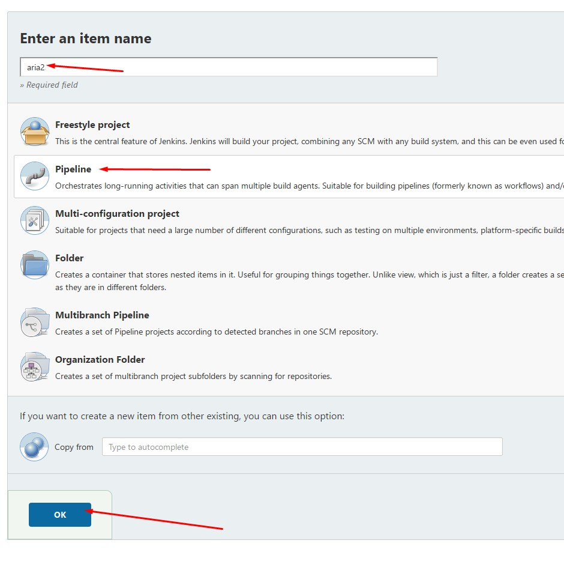
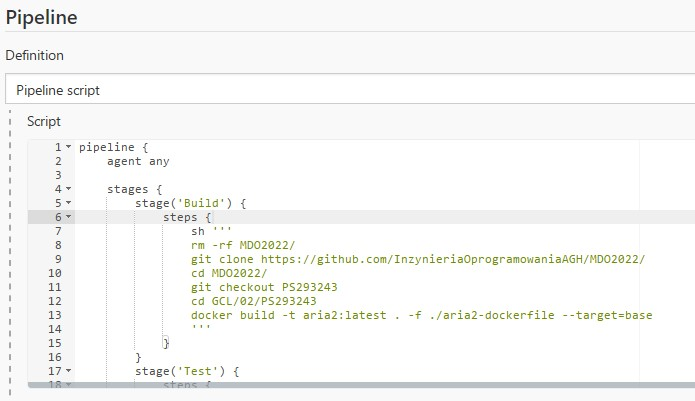
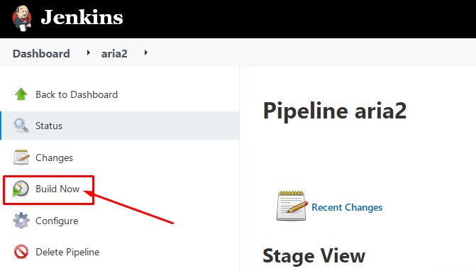
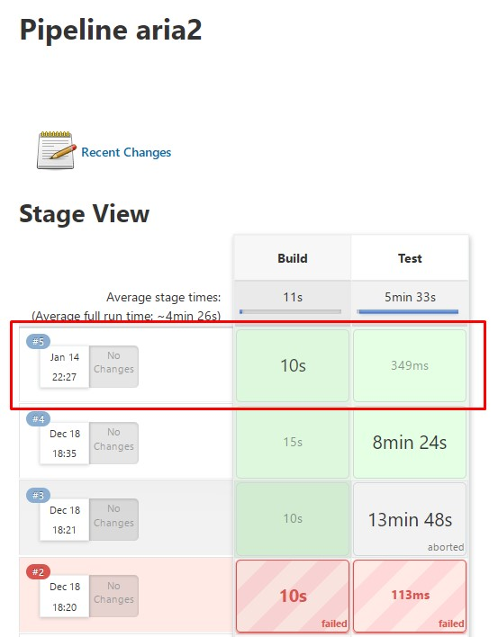
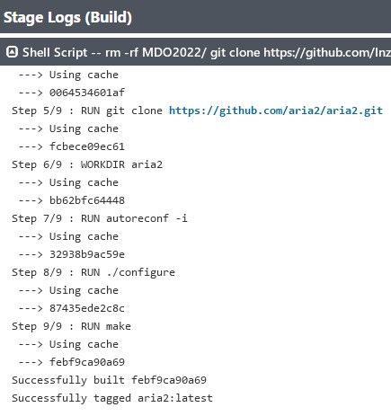
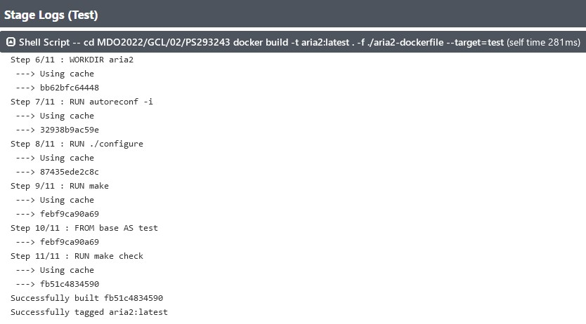
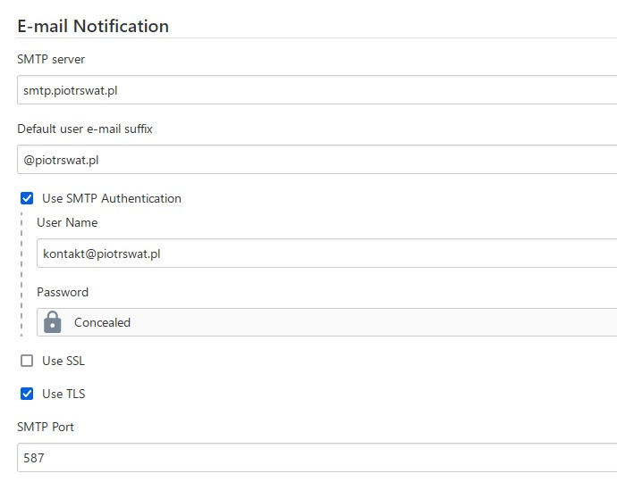
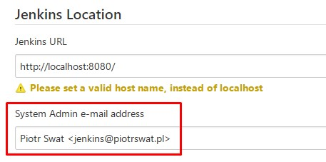
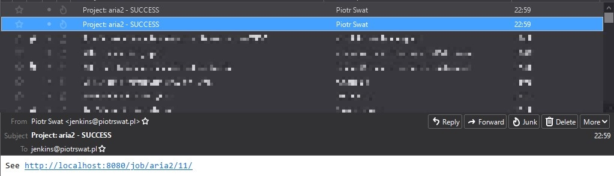

# Metodyki DevOps - sprawozdanie - zajęcia 04

## Tworzenie Jenkinsfile

### Tworzenie nowego pipeline

Logujemy się do Jenkinsa i przechodzimy do Dashboarda. Wciskamy przycisk **New item** po menu dostępnym po lewej stronie.

Uzupełniamy nazwę, wybieramy typ projektu **Pipeline** i klikamy przycisk **OK**.

Przechodzimy do sekcji **Pipeline**. W niej musimy podać treść naszego **Jenkinsfile**.

Skrypt, który przygotowałem, korzysta z pliku **Dockerfile**, który opracowałem na zajęciach 02.

Ten skrypt posiada dwa etapy - **Build** oraz **Test** - i buduje się na kontenerze CI.

Moglibiśmy sprecyzować jakiego obrazu Dockera ma używać Jenkinsfile w parametrze **agent**. 

Użycie dedykowanego Dockera do buildowania projektu ma swoje plusy takie jak izolacja środowiska czy specjalne przygotowanie środowiska pod budowanie naszego projektu (np. zainstalowane wymagane dependencje).

    pipeline {
        agent any

        stages {
            stage('Build') {
                steps {
                    sh '''
                    rm -rf MDO2022/
                    git clone https://github.com/InzynieriaOprogramowaniaAGH/MDO2022/
                    cd MDO2022/
                    git checkout PS293243
                    cd GCL/02/PS293243
                    docker build -t aria2:latest . -f ./aria2-dockerfile --target=base
                    '''
                }
            }
            stage('Test') {
                steps {
                    sh '''
                    cd MDO2022/GCL/02/PS293243
                    docker build -t aria2:latest . -f ./aria2-dockerfile --target=test
                    '''
                }
            }
        }
    }

Po zapisaniu ustawień dla naszego projektu, wciskamy przycisk **Build Now** i czekamy na wykonanie.

Jeżeli nasz projekt pomyślnie się wykonał, na stronie z jego statusem będziemy mieli informację o czasie wykonania poszczególnych etapów.

Możemy podejrzeć logi z wykonania skryptu w poszczególnych etapach.

### Wysyłanie powiadomień przez e-mail

Przechodzimy do **Manage Jenkins**, klikamy  **Configure System** i przechodzimy do sekcji **E-mail Notification** gdzie musimy podać dane do serwera SMTP za pomocą, którego wysyłane będą wiadomości.

Dodatkowo w sekcji **Jenkins Location** podajemy adres email.

Teraz musimy ponownie przejść do naszego Jenkinsfile, aby dodać do skryptu informacje o wysyłaniu wiadomości email.

W naszym przypadku, będziemy wysyłać wiadomości niezależnie od statusu builda.

    pipeline {
        agent any

        stages {
            stage('Build') {
                steps {
                    sh '''
                    rm -rf MDO2022/
                    git clone https://github.com/InzynieriaOprogramowaniaAGH/MDO2022/
                    cd MDO2022/
                    git checkout PS293243
                    cd GCL/02/PS293243
                    docker build -t aria2:latest . -f ./aria2-dockerfile --target=base
                    '''
                }
                post {
                    always {
                        mail to: 'jenkins@piotrswat.pl', subject: "Project: ${env.JOB_NAME} - ${currentBuild.currentResult}", body: "See ${BUILD_URL}"
                    }
                }
            }
            stage('Test') {
                steps {
                    sh '''
                    cd MDO2022/GCL/02/PS293243
                    docker build -t aria2:latest . -f ./aria2-dockerfile --target=test
                    '''
                }
                post {
                    always {
                        mail to: 'jenkins@piotrswat.pl', subject: "Project: ${env.JOB_NAME} - ${currentBuild.currentResult}", body: "See ${BUILD_URL}"
                    }
                }
            }
        }
    }

W porównaniu do naszego poprzedniego Jenkinsfile, dodaliśmy nową sekcję pod każdym ze stage'ów - **post** z sekcją **always**. 

Po zapisaniu projektu i wciśnięciu **Build Now**, po zakończeniu procesu powinniśmy otrzymać wiadomość email na skrzynkę pocztową, którą sprecyzowaliśmy pod **mail to**.

