# Metodyki DevOps - sprawozdanie - zajęcia 05

## Zestawienie platformy Kubernetes

### Instalacja minikube

Instalujemy minikube na podstawie dokumentacji dostępnej na stronie [minikube.sigs.k8s.io](https://minikube.sigs.k8s.io/docs/start/).

    curl -LO https://storage.googleapis.com/minikube/releases/latest/minikube-linux-amd64
    sudo install minikube-linux-amd64 /usr/local/bin/minikube

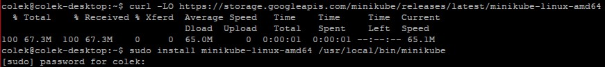

### Instalacja kubectl

Instalujemy kubectl na podstawie dokumentacji dostępnej na stronie [kubernetes.io](https://kubernetes.io/docs/tasks/tools/install-kubectl-linux/).

    curl -LO "https://dl.k8s.io/release/$(curl -L -s https://dl.k8s.io/release/stable.txt)/bin/linux/amd64/kubectl"
    sudo install -o root -g root -m 0755 kubectl /usr/local/bin/kubectl

Opcjonalnie możemy srpawdzić czy zgadzaja się suma kontrolna naszego pobranego pliku z sumą kontrolną dostępną na serwerze.

    curl -LO "https://dl.k8s.io/$(curl -L -s https://dl.k8s.io/release/stable.txt)/bin/linux/amd64/kubectl.sha256"
    echo "$(<kubectl.sha256)  kubectl" | sha256sum --check
    sudo install -o root -g root -m 0755 kubectl /usr/local/bin/kubectl

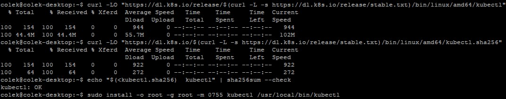

### Przedstaw uruchomione oprogramowanie wstępne (i usługi)

#### Platforma konteneryzacji

    systemctl status docker

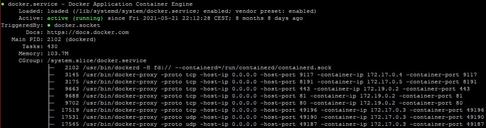

#### Otwarte porty

    sudo ss -tulpn | grep LISTEN

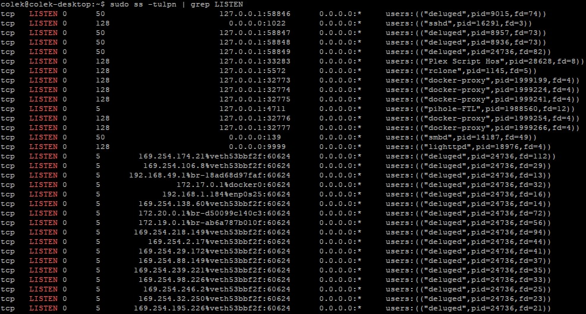

#### Stan Dockera

    docker stats

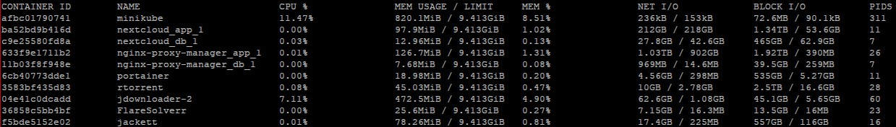

### Uruchamianie minikube

Aby uruchomić minikube poniższą komendą:

    minikube start

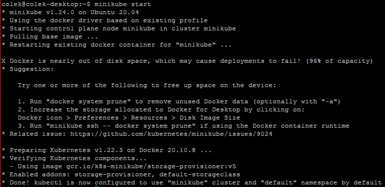

## Uruchamianie minikube Dashboard

Jeżeli jesteśmy połączeni do naszego serwera zdalnie np. przez SSH - musimy ustawić tunelowanie portów.

W moim przypadku używam klienta **KiTTY** i minicube uruchomimy na porcie 32897.

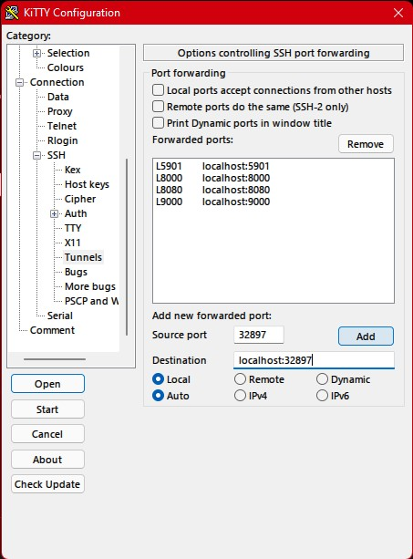

    minikube dashboard --port 32897 --url

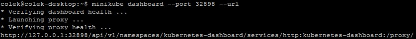

Otwieramy adres URL, który dostaliśmy na zwrotce w przeglądarce.

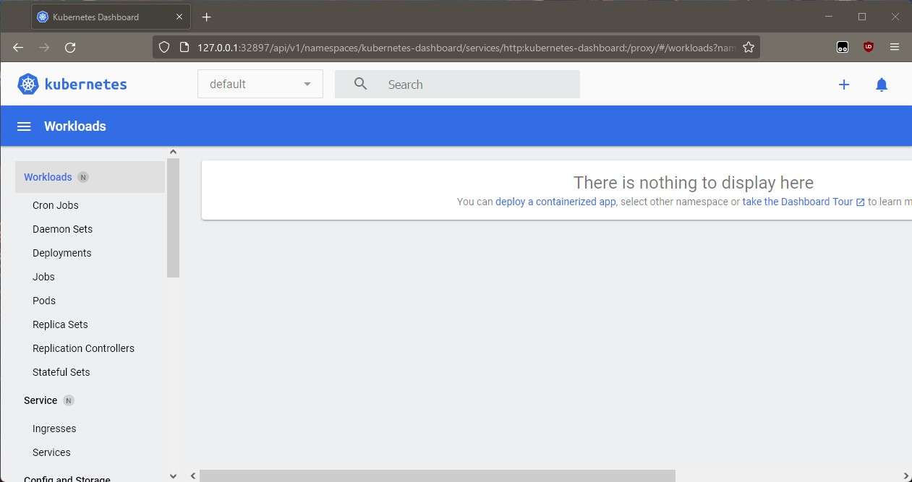

### Wyświetlanie działających usług

W panelu dostępnym po lewej stronie, klikamy na **Services** pod podmenu **Service**.

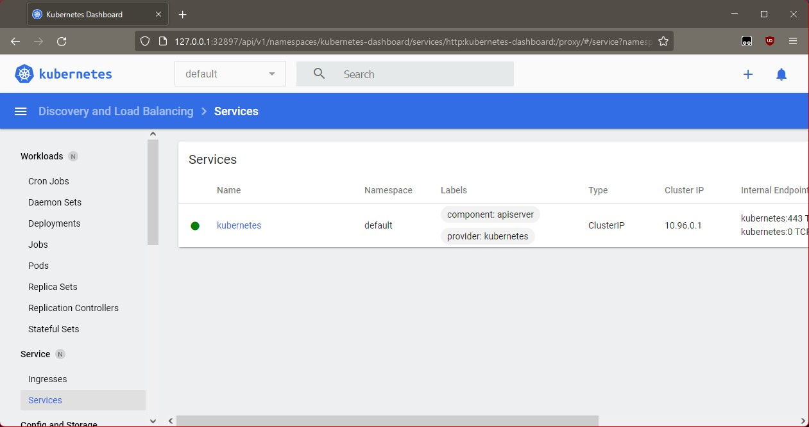

### Wyświetlanie deplyomentów (wdrożeń)

W panelu dostępnym po lewej stronie, klikamy na **Deployments** pod podmenu **Workloads**.

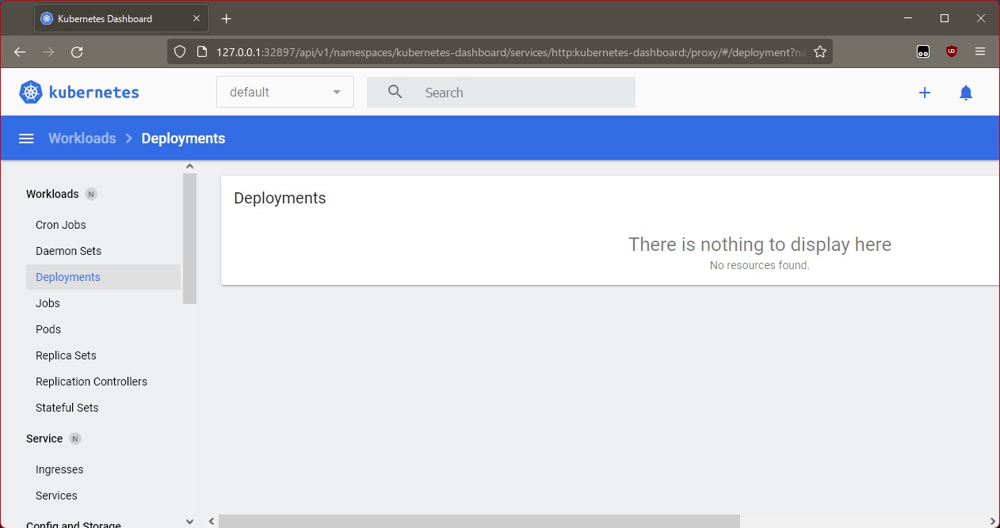

## Wdrożenie kontenera via k8s

Wdrażać będziemy przykładowy deployment **hello k8s** dostępny pod `k8s.gcr.io/echoserver`.

Używamy do tego komendy:

    kubectl create deployment hello-node --image=k8s.gcr.io/echoserver:1.4

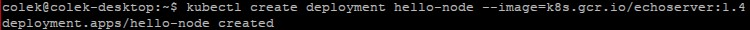

Następnie:

    kubectl run hello-node --image=k8s.gcr.io/echoserver:1.4 --port=8080 --labels app=ctr

Flaga `--port` odpowiada za przekierowanie portu na 8080.

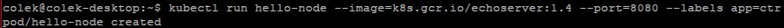

Teraz możemy sprawdzić uruchomione pody komendą:

    kubectl get pods

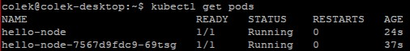

Albo przechodząc do **Pods** w Dashboardzie.

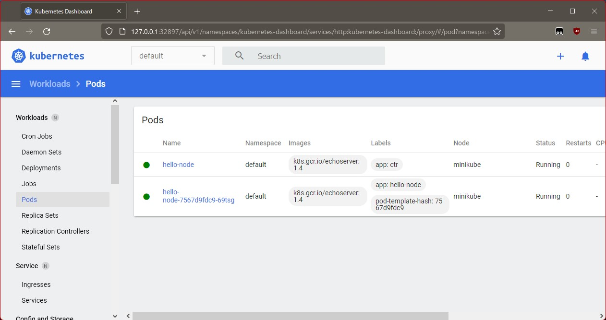

## Deployment 

### Plik .yaml

    apiVersion: apps/v1
    kind: Deployment
    metadata:
        name: hello-openshift
    spec:
        replicas: 4
        selector:
            matchLabels:
            app: hello-openshift
        template:
            metadata:
            labels:
                app: hello-openshift
            spec:
            containers:
            - name: hello-openshift
                image: openshift/hello-openshift:latest
                ports:
                - containerPort: 80

### Zwiększanie liczby replik

#### Plusy:
- zwiększona niezawodność działania aplikacji - gdy jeden z naszych podów z jakiegoś powodu przestanie działać, automatycznie na jego miejsce zostanie utworzony nowy.
- pozwala na proste skalowanie naszych aplikacji
- load-balancing

#### Minusy:
- w przypadku mniejszych projektów może nie być potrzeby zastosowania wysokich liczby replik
- większa liczba replik = większy load na serwerze

### Aplikowanie wdrożenia

    kubectl apply -f ./deploy.yaml

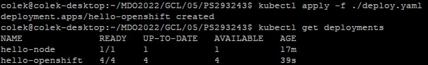
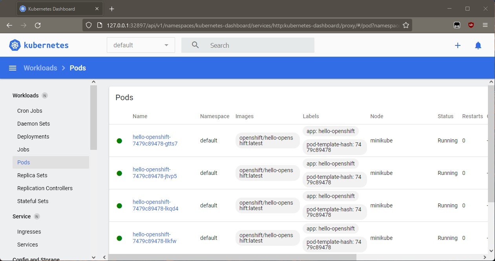