# Zajęcia 03

#### Łączność i woluminy na podstawie "złych" praktyk


* Pobierz obraz Ubuntu
```shell
$sudo docker pull ubuntu
```
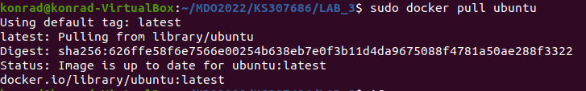
* Podłącz wolumin do kontenera
```shell
$sudo docker volume ls
$sudo docker volume create --name dysk
$sudo docker volume inspect dysk
```
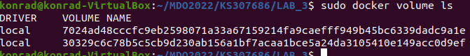
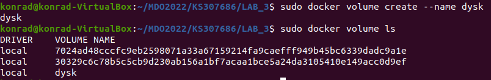
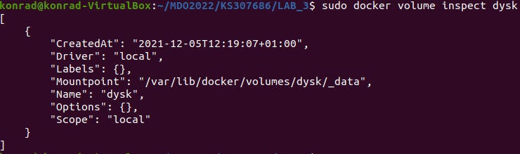
* Skopiuj plik do katalogu woluminu, pokaż w kontenerze
```shell
$touch example.txt
$sudo cp example.txt /var/lib/docker/volumes/dysk/_data/
$cd /var/lib/docker/volumes/dysk/_data/
$ls
$sudo docker run -it --mount type=bind,source=/var/lib/docker/volumes/dysk,target=/_data  ubuntu
```
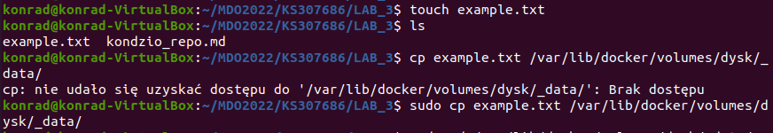
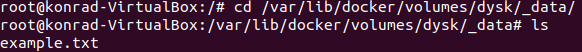
* Utwórz plik w kontenerze, na obszarze woluminu, pokaż na hoście
```shell
$sudo docker run -it --mount type=bind,source=/var/lib/docker/volumes/dysk,target=/_data  ubuntu
$touch example_from_contener.txt
$exit
$cd /var/lib/docker/volumes/dysk/_data/
$ls
```
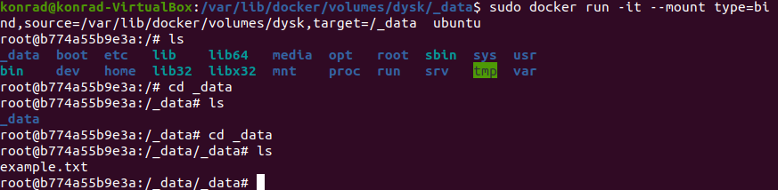

#### "Kiepski pomysł": SSH
* Uruchom i wyeksponuj wybrany port w kontenerze
```shell
$sudo netstat -tunpa
$sudo docker run -it --mount type=bind,source=/var/lib/docker/volumes/dysk,target=/_data  --publish 2222:22 ubuntu
$sudo docker ps
```
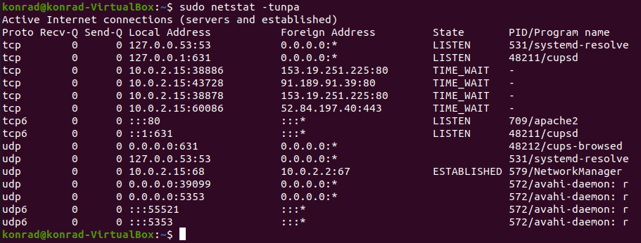
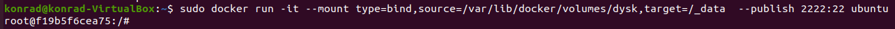
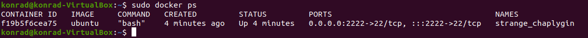
* Zainstaluj w kontenerze serwer ssh
```shell
$apt-get install upgrade && -y install openssh-server
```
* zmień port na wybrany port >1024
Zrobione 2 kroki temu 
* zezwól na logowanie root
* umieść klucz publiczny w woluminie, skopiuj go do pliku zaufanych w kontenerze
```shell
$ssh-keygen
$sudo cp id_rsa.pub /var/lib/docker/volumes/dysk/_data
```
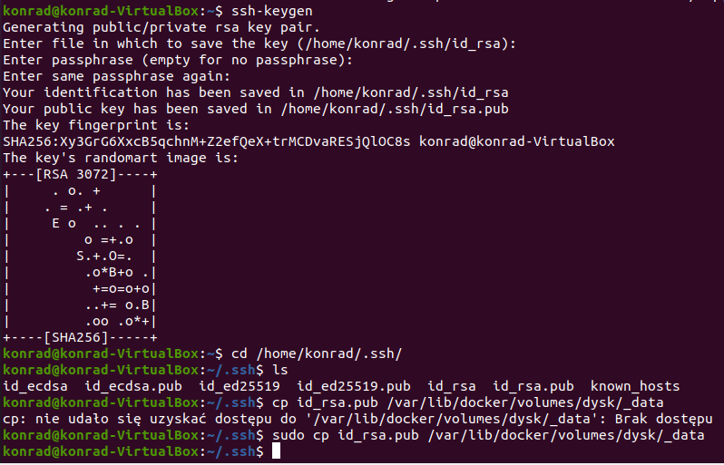
```shell
$cp id_rsa.pub /root/.ssh/authorized_keys/
```

* odnajdź adres IP kontenera w wewnętrznej sieci
```shell
$ifconfig
```
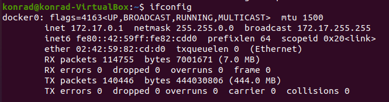
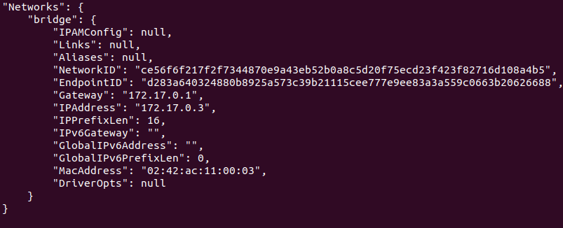
* uruchom usługę, połącz się z kontenerem
```shell
ssh root@172.17.0.1 -p 2222e
```
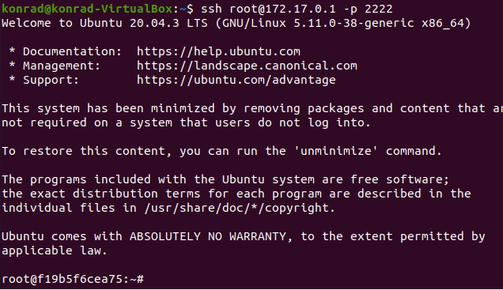
#### Skonteneryzowany Jenkins stosujący Dockera

#### Przygotowanie
* Upewnij się, że Dockerfiles i Docker Compose z poprzednich zajęć są w repozytorium
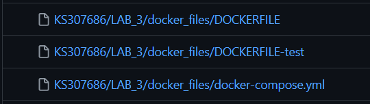
* Zapoznaj się z instrukcją https://www.jenkins.io/doc/book/installing/docker/
  * Uruchom obraz Dockera który eksponuje środowisko zagnieżdżone

  * Przygotuj obraz blueocean na podstawie obrazu jenkinsa
```shell
FROM jenkins/jenkins:2.319.1-jdk11
USER root
RUN apt-get update && apt-get install -y lsb-release
RUN curl -fsSLo /usr/share/keyrings/docker-archive-keyring.asc \
  https://download.docker.com/linux/debian/gpg
RUN echo "deb [arch=$(dpkg --print-architecture) \
  signed-by=/usr/share/keyrings/docker-archive-keyring.asc] \
  https://download.docker.com/linux/debian \
  $(lsb_release -cs) stable" > /etc/apt/sources.list.d/docker.list
RUN apt-get update && apt-get install -y docker-ce-cli
USER jenkins
RUN jenkins-plugin-cli --plugins "blueocean:1.25.2 docker-workflow:1.26"
```
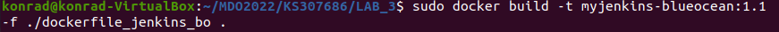
  * Uruchom blueocean
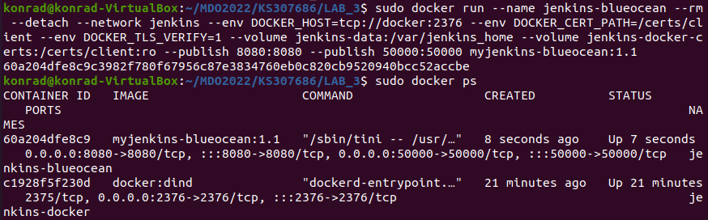  
  * Zaloguj się i skonfiguruj Jenkins
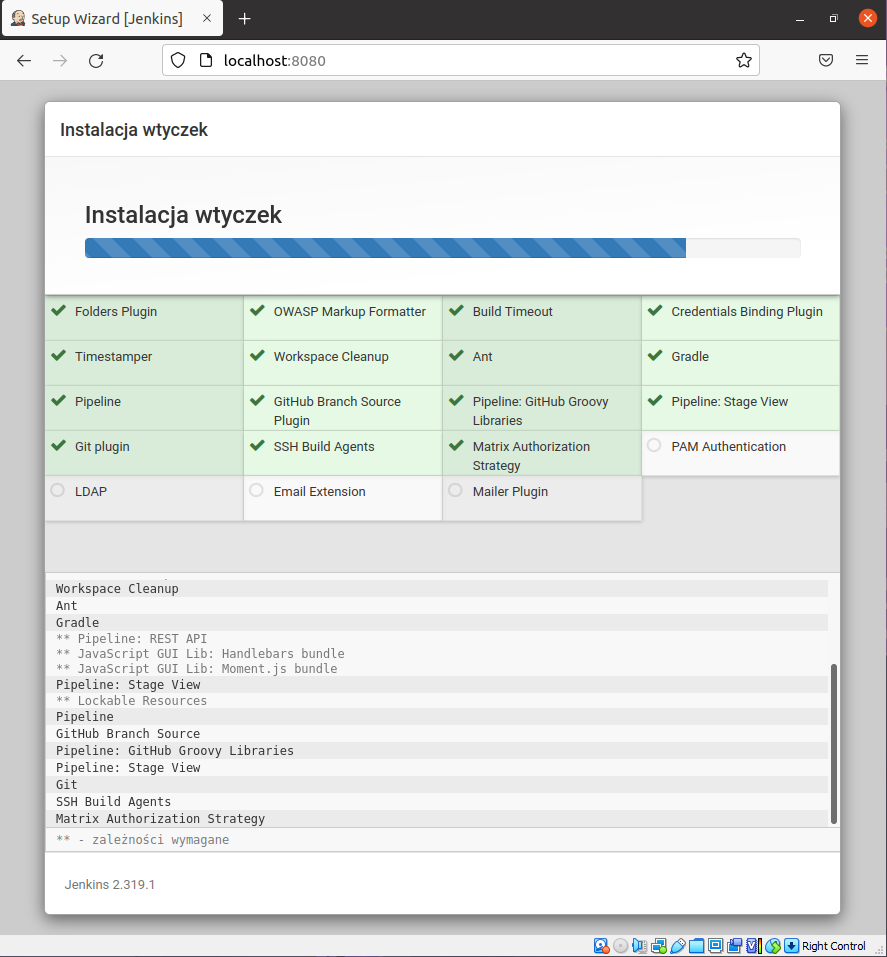
#### Mikro-projekt Jenkins
* Utwórz projekt, który wyświetla uname
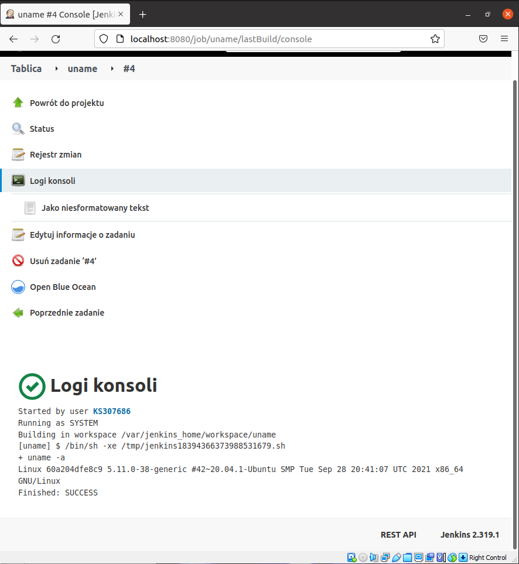
* Utwórz projekt, który zwraca błąd, gdy... godzina jest nieparzysta 
* Utwórz "prawdziwy" projekt, który:
  * klonuje nasze repozytorium
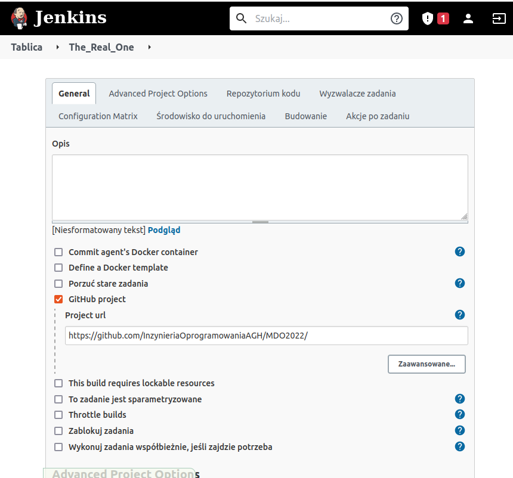
  * przechodzi na osobistą gałąź
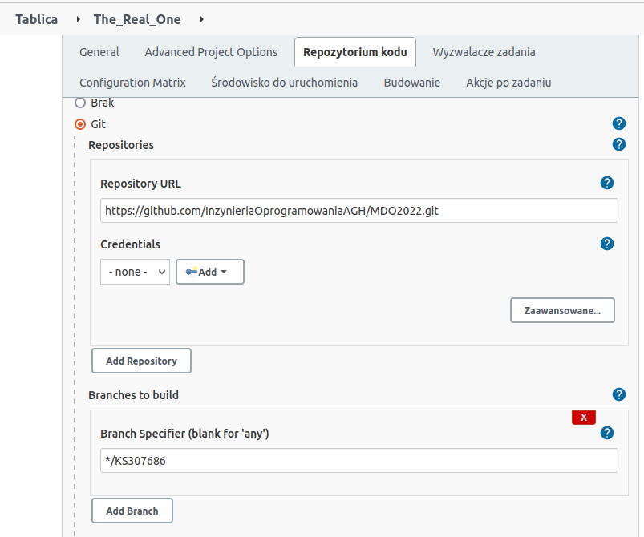
  * buduje obrazy z dockerfiles i/lub komponuje via docker-compose
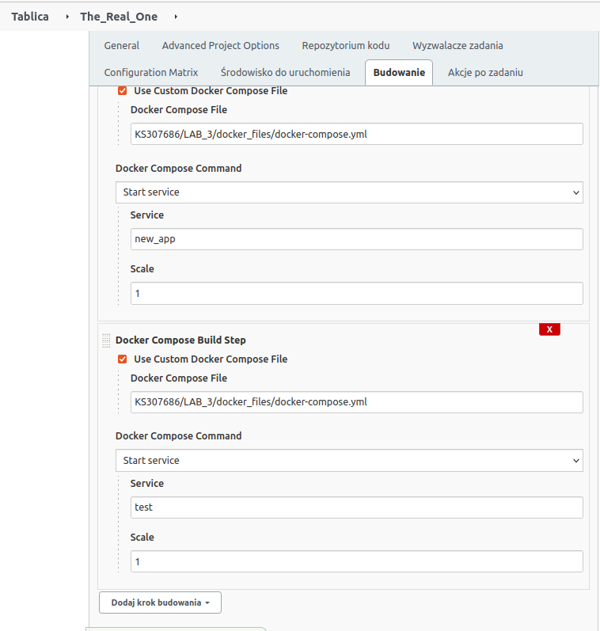
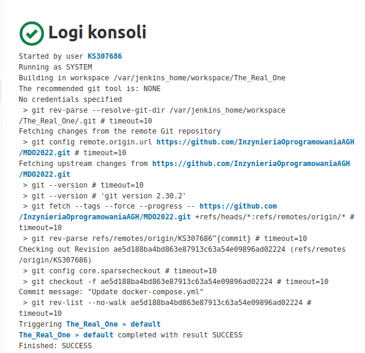
  
#### Sprawozdanie
* Opracuj dokument z diagramami UML, opisującymi proces CI. Opisz:
  * Wymagania wstępne środowiska
  * Diagram aktywności, pokazujący kolejne etapy (collect, build, test, report)
  * Diagram wdrożeniowy, opisujący relacje między składnikami, zasobami i artefaktami

