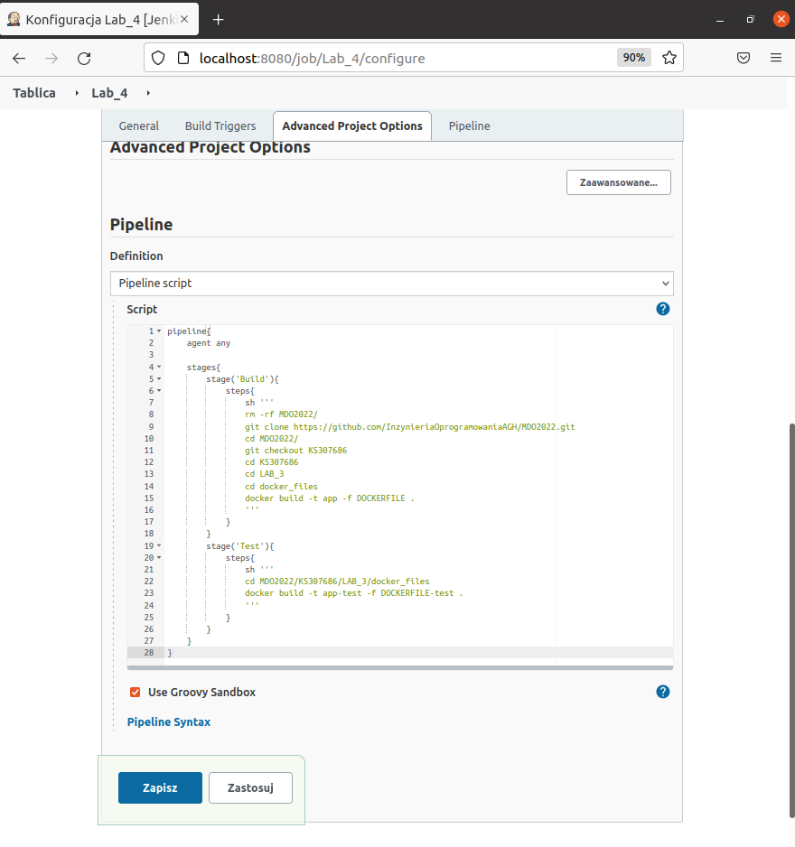
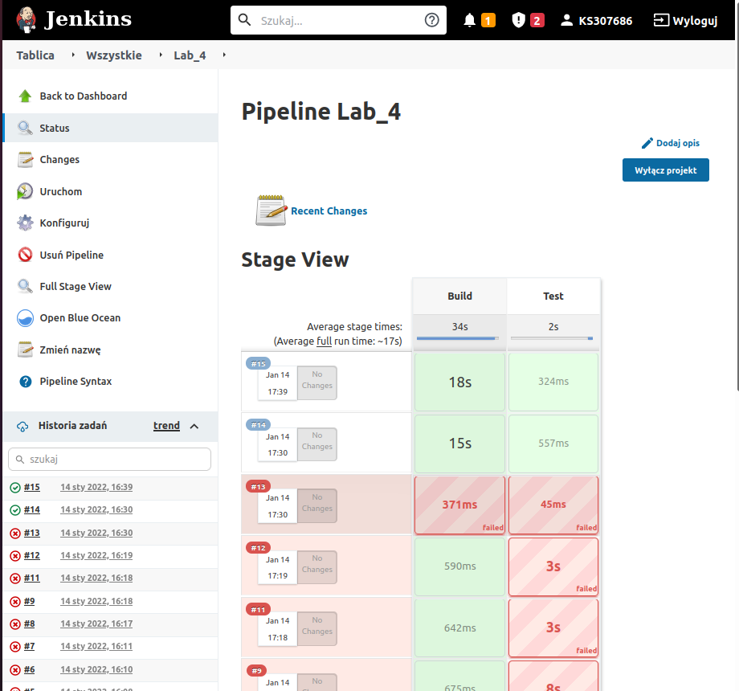
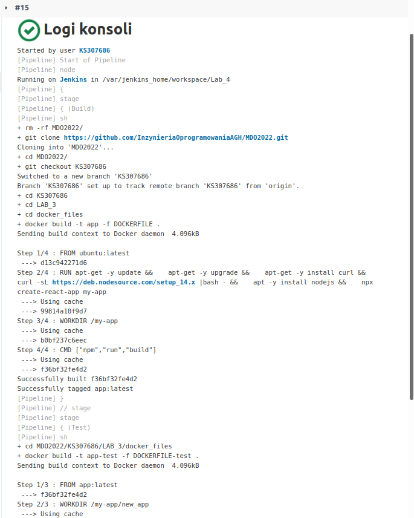
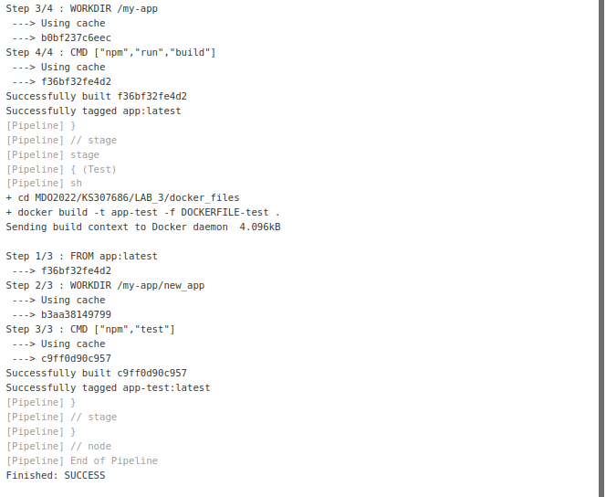
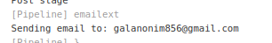

# Zajęcia 04

## Wprowadzenie 

### Zapewnij dostępność plików w gałęzi
 * skrypty, Docker files są dostępne w odpowiedniej gałęzi i katalogu w MDO2022
 
### Stwórz Jenkinsfile: opis
 * Utwórz nowy pipeline budujący wybraną aplikację, oparty o Jenkinsfile
 * Docelowo, ma zawierać etapy "Build" i "Test" 
 
  * albo pipeline zawiera treść Jenkinsfile'a
   * 
   * 
 
### Jenkinsfile: przebieg
https://www.jenkins.io/doc/book/pipeline/jenkinsfile/
* Przykładowe zbiory czynności w Jenkinsfile:
Jednokrokowy pipeline (Build i test), pobierający narzędzie docker-compose i uruchamiajacy docker compose up na kompozycji z poprzednich zajęć
  * build + test
    * download docker-compose
	* compose up
To się nie udało, przy próbie instalacji docker-compose zawsze miałem odmowę dostępu do katalogu...
Więc wróciłem do opcji Buld i test na oddzielnym dockerfile:

### Jenkinsfile: powiadomienia
  * Sekcja "post" dla każdego stage'a, informująca mailem o rezultacie
  *   
  *   
### Jenkinsfile: deploy 
