1. Sprawdzono wersje dockera 

2. Sprawdzono wersje obrazu ubuntu 

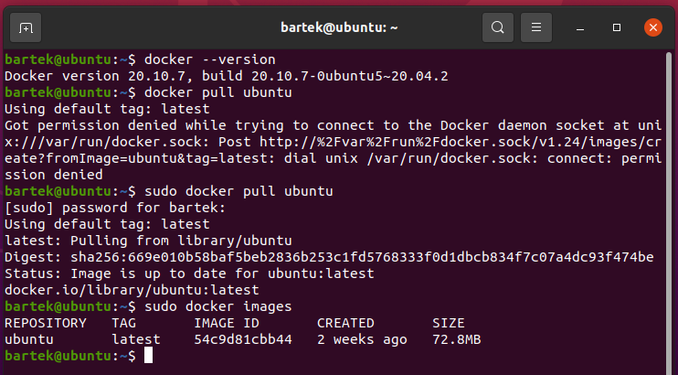

3. Zainstalowano busyboxa
 
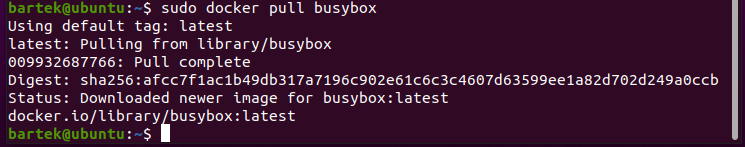

4. Uruchomiono busyboxa, sprawdzono zawartosc i wylaczono dockery 

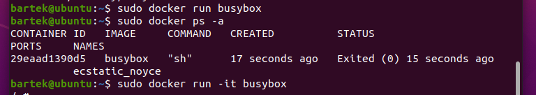
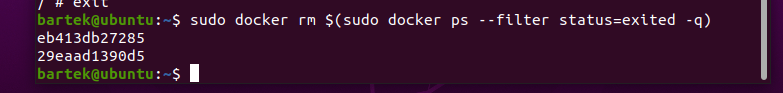

Uruchomiono dockera z ubuntu

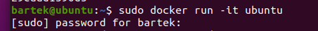

zainstalowano zaleznosci 

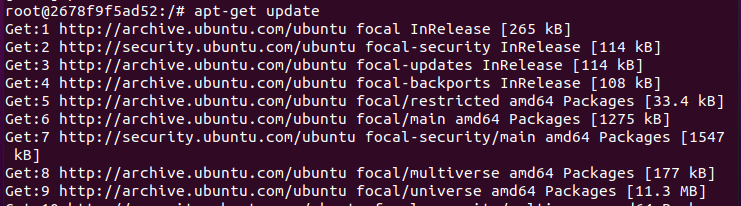
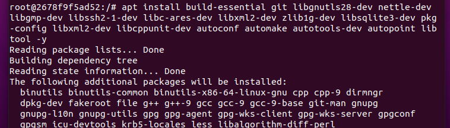

Wybrano program i pobrano go https://github.com/aria2/aria2.git

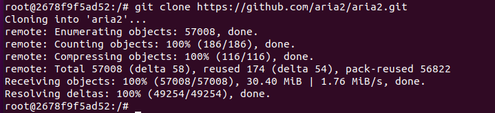

Zbudowano aplikacje zgodnie z README 

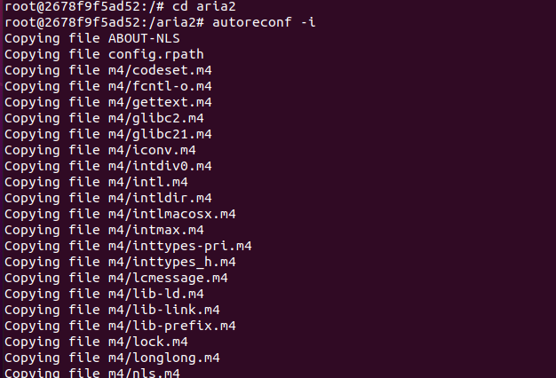

./configure 

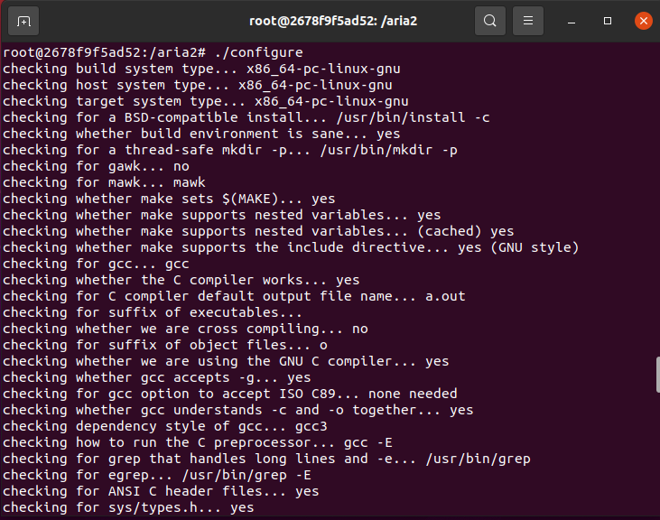

make

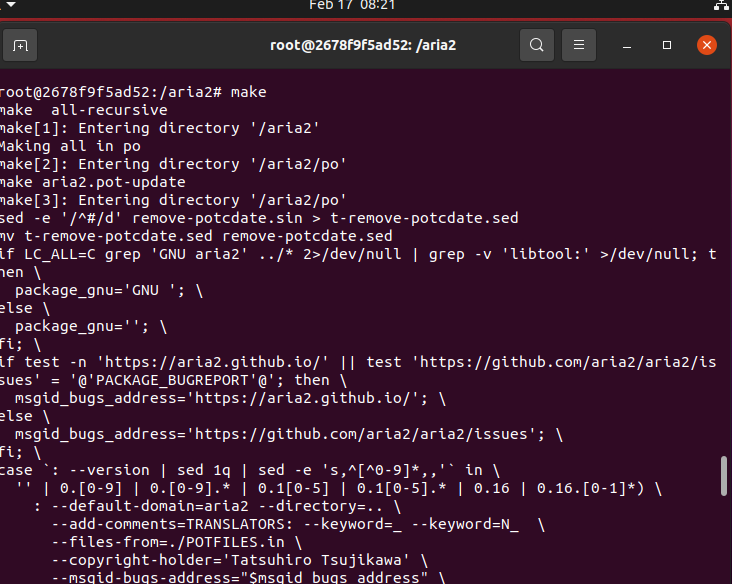

Nastepnie uruchomiono testy make check 

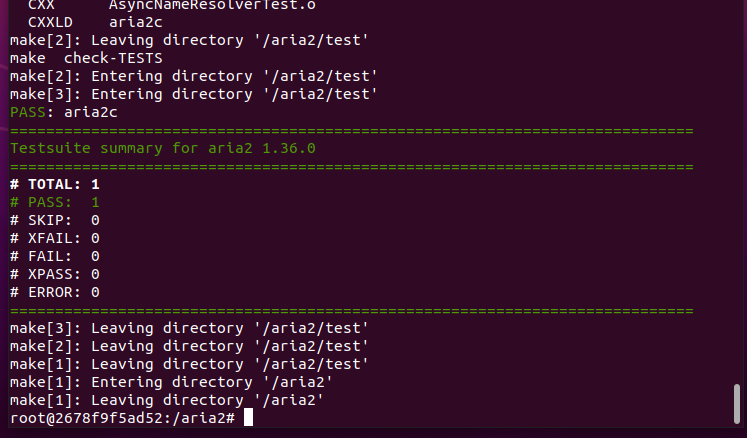

Dla automatyzacji tworzenia powyższych kroków stworzono Dockerfile'a. 

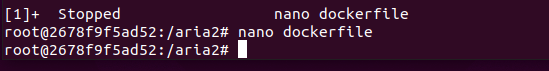
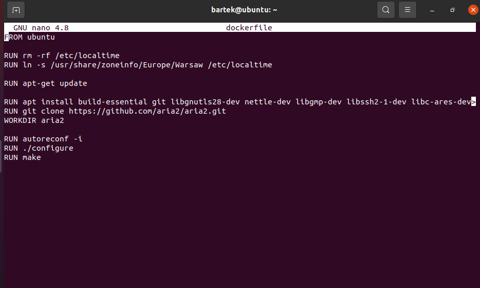

Stworzono drugi Dockefile wywołujący pierwszego natomiast z dodanymi testami

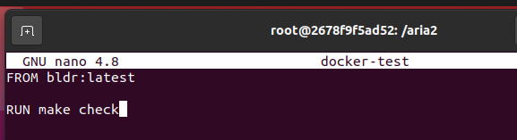

Uruchomiono dockerfile 

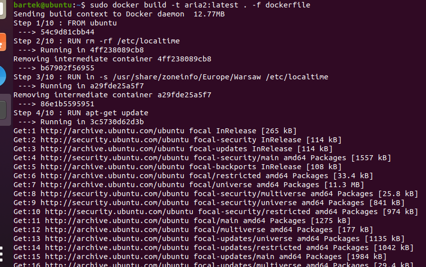
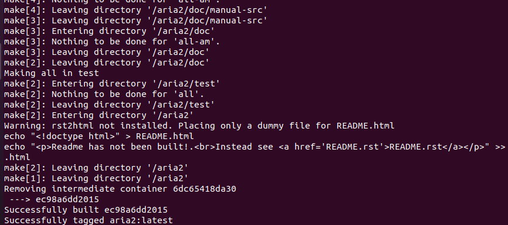

Stworzono plik docker-compose

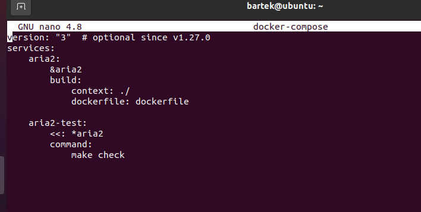

### AUTOMATYZATOR JENKINS z zalaczonej instrukcji 

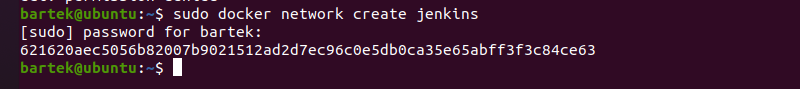

Stworzono nowy dockerfile i zbudowano nowy obraz

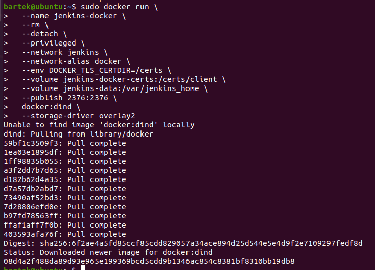
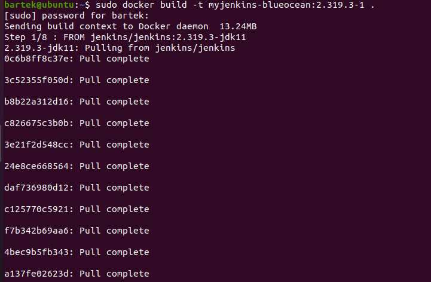

