1. Sprawdzono wersje dockera 

2. Sprawdzono wersje obrazu ubuntu 


3. Zainstalowano busyboxa
 


4. Uruchomiono busyboxa, sprawdzono zawartosc i wylaczono dockery 


Uruchomiono dockera z ubuntu


zainstalowano zaleznosci 


Wybrano program i pobrano go https://github.com/aria2/aria2.git


Zbudowano aplikacje zgodnie z README 


./configure 


make


Nastepnie uruchomiono testy make check 


Dla automatyzacji tworzenia powyższych kroków stworzono Dockerfile'a. 


Stworzono drugi Dockefile wywołujący pierwszego natomiast z dodanymi testami


Uruchomiono dockerfile 


Stworzono plik docker-compose


### AUTOMATYZATOR JENKINS z zalaczonej instrukcji 


Stworzono nowy dockerfile i zbudowano nowy obraz


Po zbudowaniu obrazu uruchamiamy go w kontenerze 

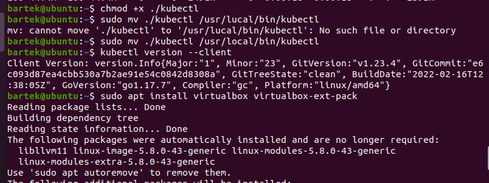

Zalogowano sie do Jenkinska uzwyajac wygenerowanego hasla 

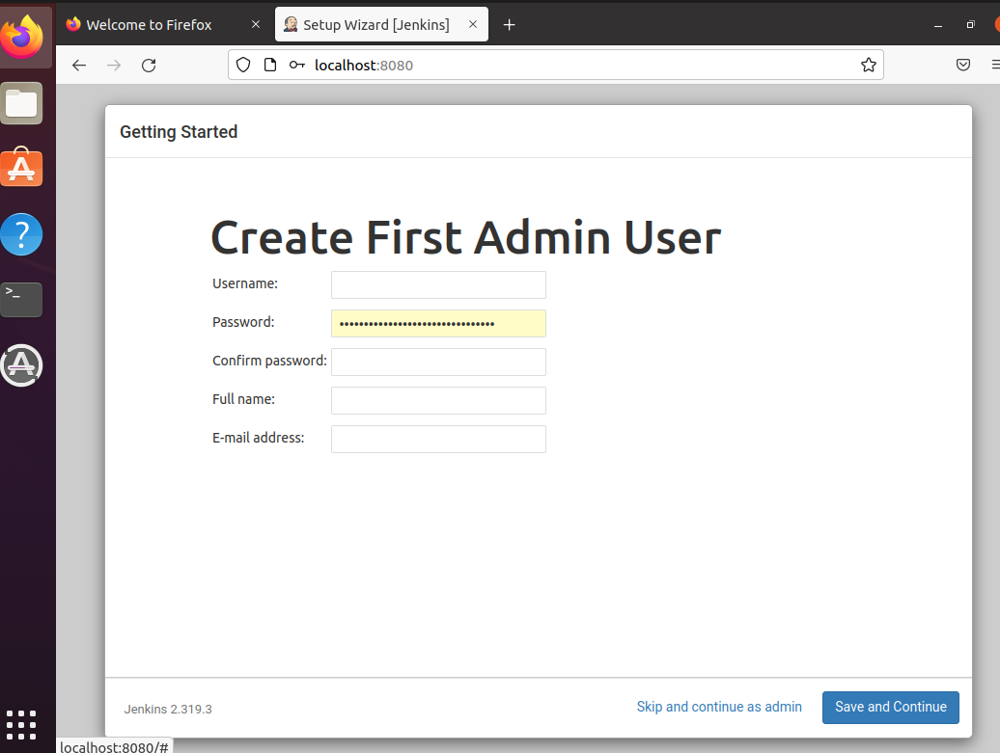
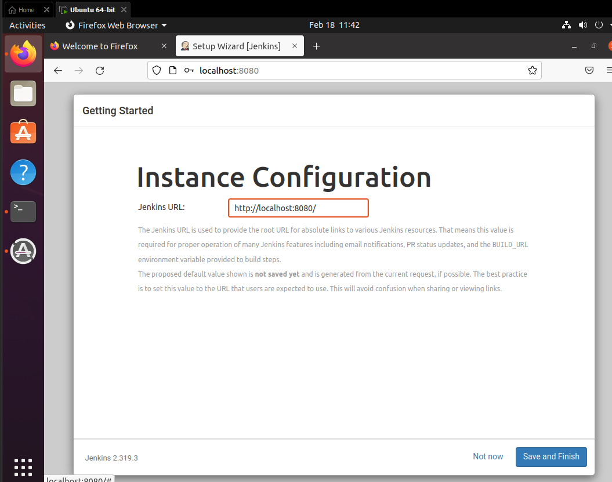

Stworzono pipeline i uruchomiono 
```

pipeline {
    agent any
    
    stages {
        stage('Build') {
            steps {
                sh '''
                rm -rf MDO2022
                git clone https://github.com/InzynieriaOprogramowaniaAGH/MDO2022.git
                cd MDO2022
                git checkout BS292981
                cd projekt_zaliczeniowy
                docker build -t aria2:latest . -f ./dockerfile1
                '''
            }
        }
        stage('Test') {
            steps {
                sh '''
                cd MDO2022/projekt_zaliczeniowy
                docker build -t aria2_test:latest . -f ./dockerfile-test
                '''
            }
        }
    }
}

```
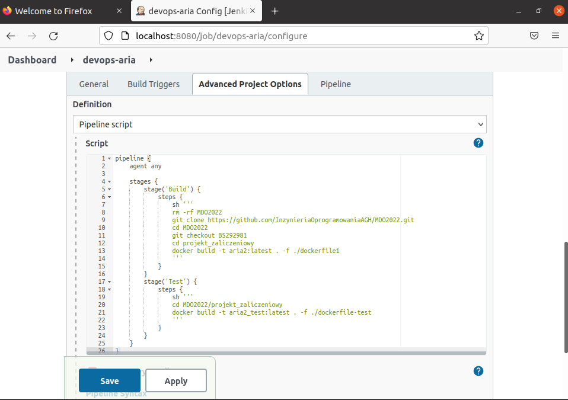
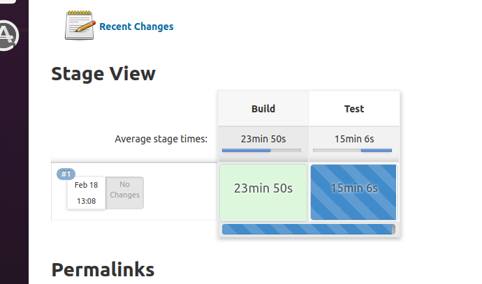
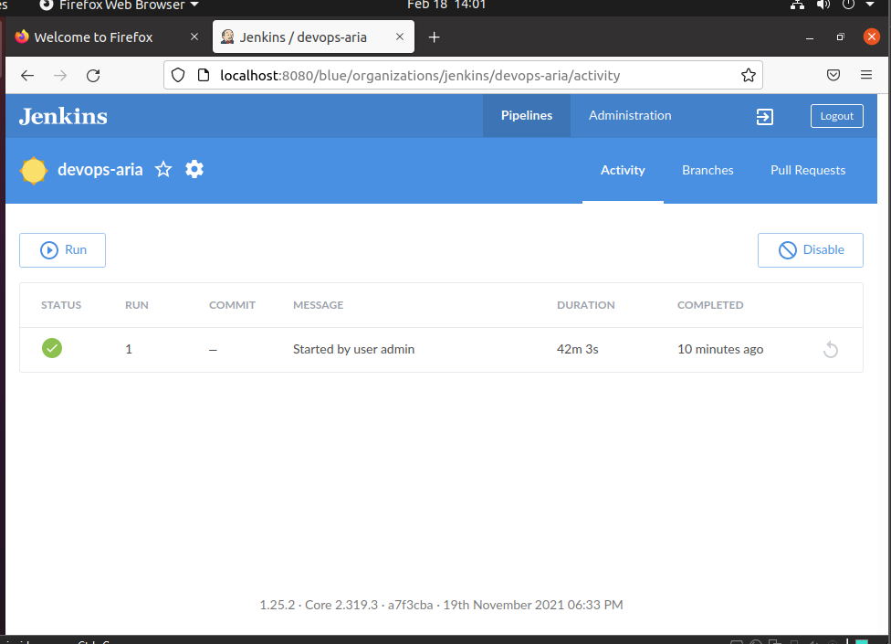
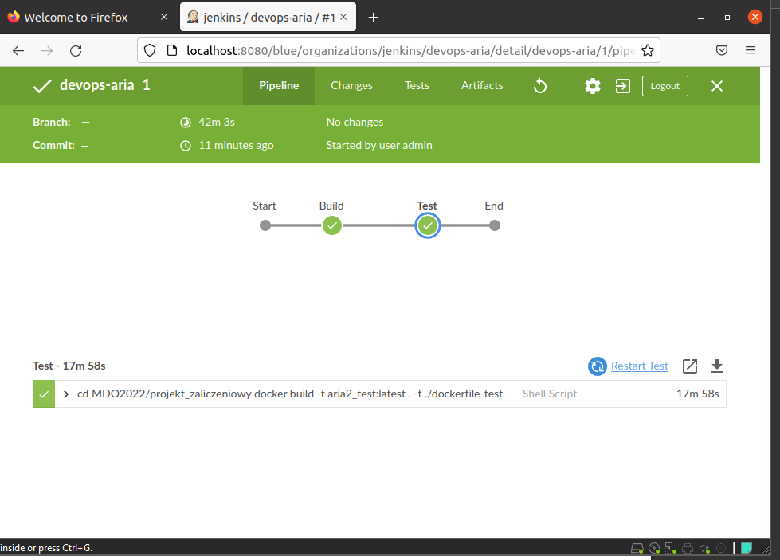

pobrano logi i artifact 

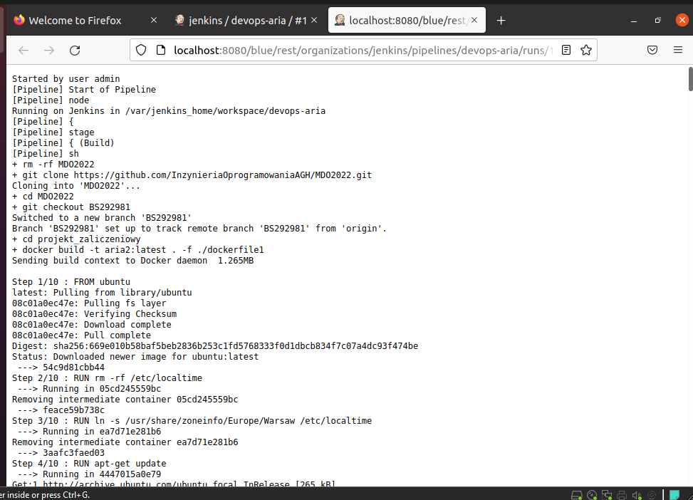

Zaktualizowano pakiety systemowe
apt update

apt upgrade
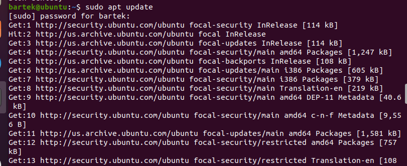
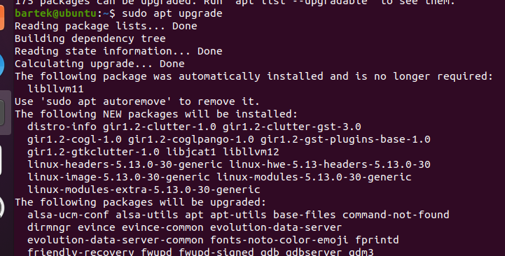

Zainstalowano pakiet curl
apt install curl

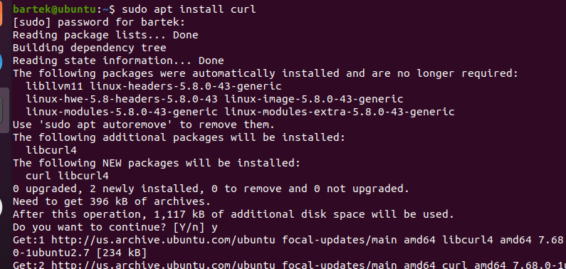

Pobranie najnowszej wersji kubectl
curl -LO https://storage.googleapis.com/kubernetes-release/release/`curl -s https://storage.googleapis.com/kubernetes-release/release/stable.txt`/bin/linux/amd64/kubectl

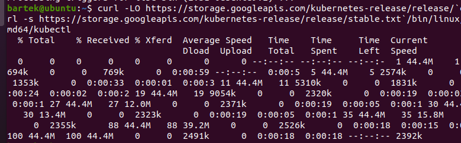

Dodanie uprawnień do uruchamiania
chmod +x ./kubectl

Dodanie kuble ctl do ścieżki - PATH
sudo mv ./kubectl /usr/local/bin/kubectl

Sprawdzenie wersji
kubectl version --client

instalalowano virtualboxa


